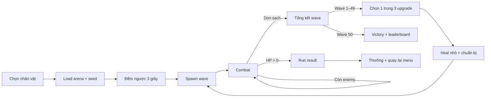
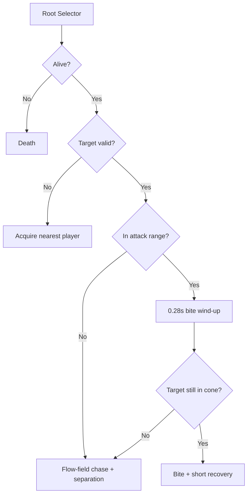
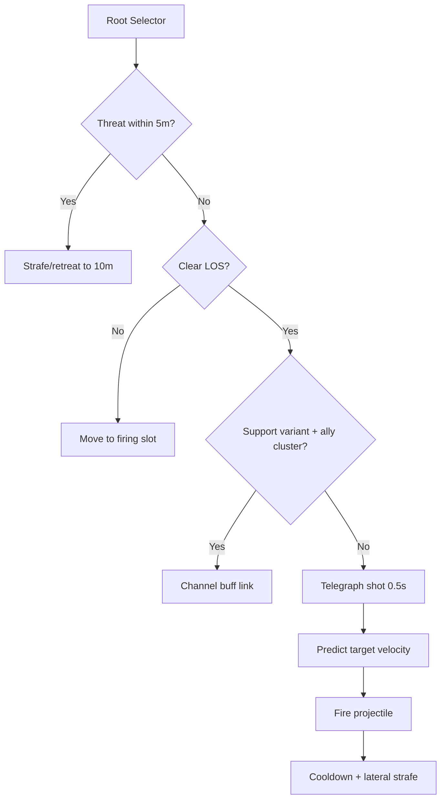
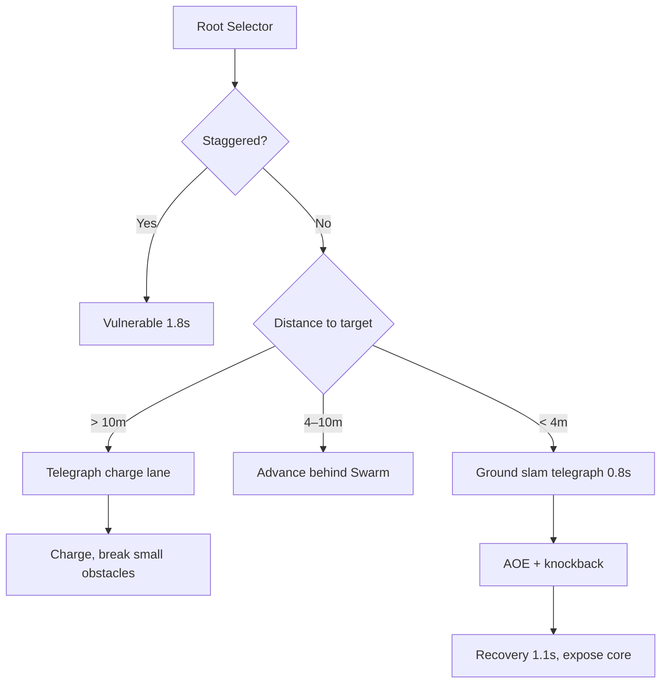

# GDD — Aegis Rift: 3D Wave Survival Roguelite

## 0. Thông tin tài liệu

| Thuộc tính | Giá trị |
|---|---|
| Tên tạm | **Aegis Rift** |
| Loại nội dung | Minigame phụ của Apple Knight Adventure |
| Thể loại | 3D arena wave survival + action roguelite |
| Nền tảng | PC, keyboard/gamepad, 1 người ở bản đầu |
| Engine/runtime mục tiêu | C++17 + raylib 6.0, cùng executable với game chính |
| Camera | Third-person góc cao 3/4, xoay nhẹ theo hướng ngắm |
| Thời lượng một run hoàn chỉnh | 35–45 phút cho 50 wave |
| Trạng thái | Design baseline v1.0 |

Tài liệu kỹ thuật đi kèm: [TDD_3D_WAVE_SURVIVAL.md](./TDD_3D_WAVE_SURVIVAL.md).

## 1. High concept

Một khe nứt không gian mở ra bên cạnh thế giới chính. Người chơi chọn **Knight** hoặc **Magic Caster**, bước vào đấu trường 3D và sống sót qua 50 wave. Sau mỗi wave, thời gian dừng lại và người chơi chọn một trong ba nâng cấp để biến bộ kỹ năng ban đầu thành một build riêng. Boss xuất hiện tại wave 10, 20, 30, 40 và 50.

Minigame dùng chung nhân vật, font, âm thanh, tiền và hồ sơ của game chính, nhưng có combat 3D, progression trong run và leaderboard riêng. Kết quả run có thể thưởng coin/cosmetic cho game chính; chỉ số roguelite trong run không làm thay đổi cân bằng campaign.

### 1.1 Trụ cột trải nghiệm

1. **Đọc tình huống nhanh:** silhouette và telegraph rõ ràng dù có 80–120 enemy.
2. **Impact có kiểm soát:** hit stop, camera impulse, VFX và âm thanh làm đòn đánh có trọng lượng nhưng không che gameplay.
3. **Build thay đổi cách chơi:** nâng cấp không chỉ tăng số; chúng đổi phạm vi, thuộc tính, combo và cách định vị.
4. **Áp lực tăng theo nhịp:** mỗi 10 wave là một chương, có boss và thay đổi bố cục/luật đấu trường.
5. **Công bằng để cạnh tranh:** seed, công thức scaling và điểm số có thể tái lập; meta progression thiên về mở khóa/cosmetic.

### 1.2 Đối tượng người chơi

- Người thích Vampire Survivors/Hades-style build crafting nhưng muốn điều khiển kỹ năng chủ động.
- Người chơi campaign muốn một mode ngắn để kiếm coin, thử nhân vật và cạnh tranh điểm.
- Mức kỹ năng mục tiêu: dễ hiểu trong 3 wave đầu, khó hoàn thành wave 50 nếu build/positioning kém.

## 2. Core loop và luật trận



### 2.1 Nhịp một wave

- `3 giây`: banner wave, camera overview ngắn và marker hướng spawn.
- `35–55 giây`: wave thường; director spawn theo budget thay vì thả toàn bộ cùng lúc.
- `10 giây`: thời gian mục tiêu để chọn upgrade; game pause hoàn toàn khi card UI mở.
- Boss wave: 90–180 giây, không giới hạn cứng nhưng giảm điểm time bonus theo thời gian.
- Sau wave thường: hồi `8% Max HP`; sau boss: hồi `25% Max HP` và chọn upgrade Legendary/Evolution.

### 2.2 Điều kiện thắng/thua

- Thắng: đánh bại Final Boss tại wave 50.
- Thua: toàn bộ HP về 0; không hồi sinh mặc định.
- Một lần `Second Wind` có thể xuất hiện dưới dạng upgrade Legendary, hồi sinh với 35% HP.
- Tạm dừng không cộng vào survival time hay wave clear time.

### 2.3 Arena

- Kích thước chuẩn: `44 m × 44 m`, khu vực chiến đấu hữu dụng khoảng `40 m × 40 m`.
- Tường bao kín; 4 cổng spawn chính và 4 khe phụ.
- Chướng ngại thấp không chặn camera; cột/tường cao có fade khi che player.
- Mỗi chapter 10 wave kích hoạt một biến thể: cột đá, vùng slow, lane hẹp hoặc hazard xoay.
- Nav grid dùng ô `0.5 m`; player và enemy không thể rời arena.

### 2.4 Camera và điều khiển

| Action | Keyboard mặc định | Gamepad | Ghi chú |
|---|---|---|---|
| Di chuyển | WASD / Arrow | Left Stick | 8 hướng trên mặt phẳng XZ |
| Ngắm | Mouse | Right Stick | Soft-lock mục tiêu gần con trỏ |
| Basic | J / LMB | X | Giữ để auto-chain nếu hỗ trợ |
| Skill 1 | K / RMB | Y | Kế thừa muscle memory game chính |
| Skill 2 | U / Q | RB | Kỹ năng kiểm soát/di chuyển |
| Ultimate | H / R | LB+RB | Nạp qua gây damage/kill |
| Dash | L / Space | B | Có i-frame ngắn |
| Pause | Esc | Menu | Không tính thời gian |

Camera đặt sau player `10–12 m`, cao `11–13 m`, FOV 48–55°. Camera chỉ rung rotational/positional rất nhỏ; không roll camera. Khi đông enemy, camera tự zoom ra tối đa 12%.

## 3. Art direction và pipeline 2D → 3D

### 3.1 Art direction chung

Phong cách: **stylized anime low-poly, vật liệu hand-painted/PBR nhẹ**. Tỷ lệ đầu lớn hơn thực tế 8–12%, tay/vũ khí lớn để đọc silhouette ở camera xa. Không theo photorealism.

- Knight: tím đậm, đen, điểm emissive tím hồng; shape language vuông, nặng, giáp chồng lớp.
- Magic Caster: xanh lam/cyan, trắng, nâu staff; shape language tròn, vải mềm, hạt phép lơ lửng.
- Enemy: nền xám/đen với màu vai trò rõ: Swarm đỏ cam, Ranger xanh lục, Tanker vàng đất.
- Boss: lấy palette chapter rồi thêm emissive tím của Rift để giữ chung nguồn gốc.

### 3.2 Tỷ lệ và budget model

| Asset | Chiều cao game | LOD0 | LOD1 | LOD2 | Texture |
|---|---:|---:|---:|---:|---|
| Magic Caster | 1.75 m | 24–30k tris | 12–16k | 4–7k | 2K body + 1K staff |
| Knight | 1.89 m | 30–38k tris | 16–20k | 6–9k | 2K body + 1K sword |
| Swarm | 1.05 m | 6–9k | 3–5k | billboard/1.5k | 1K atlas |
| Ranger | 1.70 m | 10–14k | 5–8k | 2–3k | 1K–2K |
| Tanker | 2.65 m | 18–26k | 9–14k | 4–6k | 2K |
| Boss | 3.5–7.5 m | 45–90k | 22–45k | 10–20k | 2K–4K |

### 3.3 Pipeline sản xuất

1. **2D audit:** tách silhouette, vật liệu, phụ kiện và màu từ sprite source hiện có; xác định chi tiết nào chỉ là pixel noise và không dựng thành geometry.
2. **Model sheet:** tạo front/side/back 3/4, neutral A-pose, bảng vật liệu và close-up vũ khí. Chốt chiều cao theo mét.
3. **Blockout:** Blender, primitive lớn trước; test silhouette bằng camera gameplay và ánh sáng phẳng.
4. **High-poly/sculpt:** chỉ sculpt nếp vải, giáp và khuôn mặt đủ để bake; tóc dùng khối stylized, không dùng hair cards dày đặc.
5. **Retopology:** edge loop vai/khuỷu/gối/hông; giáp cứng tách mesh hoặc weight cứng; tránh polygon dài ở cape.
6. **UV:** 1 bộ body, 1 bộ weapon; texel density nhất quán; mirror phần không bất đối xứng; padding tối thiểu 8 px ở 2K.
7. **Bake:** normal, AO, curvature, thickness; cage được kiểm thủ công ở tóc, vai giáp và staff core.
8. **Texture:** base color hand-painted, roughness có phân cấp rõ, metallic chỉ cho kim loại, emissive mask riêng cho rune/core.
9. **Rig:** humanoid chung, root + pelvis + IK hand/foot; cape/hair dùng 6–12 bones phụ; weapon socket tại tay phải/trái.
10. **Skinning:** giới hạn 4 influence/vertex; test extreme pose, twist forearm và cape; không để giáp mềm như vải.
11. **Animation:** locomotion in-place; dash/attack có animation curve nhưng displacement do gameplay code quyết định để collision ổn định.
12. **Export:** master `.blend`; runtime ưu tiên `.glb` có skin/clip, `.iqm` là fallback đã kiểm chứng; 1 đơn vị DCC = 1 mét, Y-up theo runtime raylib.
13. **Validation:** kiểm tra scale, pivot chân, bone names, clip ranges, material count, LOD, bounding volume và draw call trong scene benchmark 100 enemy.

### 3.4 Naming và cấu trúc asset

```text
assets/survival3d/
  characters/knight/{knight.glb, materials/, textures/}
  characters/magic_caster/{magic_caster.glb, materials/, textures/}
  enemies/{riftling,hex_archer,obsidian_brute}/
  bosses/{brood_warden,hexeye,ironroot,eclipse_chimera,void_sovereign}/
  animations/humanoid/
  vfx/{physical,arcane,fire,frost,void}/
  arenas/rift_coliseum/
```

Clip: `char_action_variant`, ví dụ `knight_attack_light_01`; texture: `knight_body_basecolor`, `knight_body_normal`, `knight_body_orm`, `knight_body_emissive`.

## 4. Thiết kế Knight

### 4.1 Vai trò và chỉ số gốc

| Stat | Giá trị |
|---|---:|
| HP | 140 |
| Move speed | 5.2 m/s |
| Dash | 6 m trong 0.24 s, i-frame 0.16 s |
| Armor | giảm 12% physical damage |
| Ultimate charge | 100, nhận theo damage gây ra và parry |

Knight là bruiser cận chiến: đi vào vùng nguy hiểm, gom quái, parry và đổi phòng thủ thành damage.

### 4.2 Bộ kỹ năng

| Slot | Kỹ năng | Cơ chế gốc | Cooldown |
|---|---|---|---:|
| Basic | **Violet Edge** | Combo 3 hit: 1.0× / 1.1× / 1.6× damage; hit 3 quét cung 160° | 0.18 s giữa hit |
| K | **Aegis Counter** | Guard 0.65 s; parry trong 0.22 s đầu. Parry tạo shockwave 3.5 m và +25 Ultimate | 6 s |
| U | **Shield Rush** | Càn 7 m, kéo Swarm theo hướng chạy, chặn projectile phía trước; kết thúc bằng shield bash | 8 s |
| H | **Bastion Breaker** | Nhảy ngắn và slam 5.5 m; taunt 4 s, tạo vùng giảm 25% damage nhận trong 6 s | Ultimate |
| Dash | **Steel Step** | Dash có i-frame, va Swarm sẽ hất nhẹ chứ không dừng | 1.2 s |

### 4.3 Animation/VFX/impact

| State/clip | Thời lượng | Gameplay window | Presentation |
|---|---:|---|---|
| Idle | 2.4 s loop | — | thở nhẹ, cape/hair secondary, rune kiếm pulse |
| Run | 0.72 s loop | tốc độ code-driven | giáp rung nhẹ, dust ở chân mỗi contact |
| Attack 1 | 0.42 s | hit 0.16–0.22 | trail tím mảnh; hit stop 45 ms; shake 0.10/0.08 s |
| Attack 2 | 0.48 s | hit 0.20–0.27 | trail rộng hơn; sparks theo normal |
| Attack 3 | 0.68 s | hit 0.29–0.40 | arc 160°; hit stop 70 ms; shake 0.22/0.12 s |
| Guard | loop tối đa 0.65 s | parry 0–0.22 | shield plane tím, âm cao dần |
| Perfect Parry | 0.52 s | shockwave ở 0.08 | freeze attacker 90 ms; radial ring; shake 0.28/0.16 s |
| Shield Rush | 0.80 s | collision 0.10–0.62 | dust cone, speed lines; camera FOV +3° |
| Ultimate Slam | 1.45 s | impact 0.82 | decal nứt 5.5 m, debris pool; hit stop 110 ms; shake 0.65/0.28 s |
| Hurt light/heavy | 0.32/0.60 s | armor super-state tùy build | flash material 60 ms, không đổi camera hướng |
| Death | 1.7 s | input lock | sword rơi có physics giả, dissolve tím cuối clip |

Camera shake ghi theo `amplitude (m hoặc độ) / duration`; cường độ tổng bị clamp để nhiều hit không cộng vô hạn.

## 5. Thiết kế Magic Caster

### 5.1 Vai trò và chỉ số gốc

| Stat | Giá trị |
|---|---:|
| HP | 90 |
| Move speed | 5.8 m/s |
| Blink | 5 m, i-frame 0.12 s |
| Arcane Energy | 100; basic hồi 7/hit, skill tiêu hao hoặc dùng cooldown |
| Ultimate charge | 100, tăng mạnh khi đánh trúng nhiều mục tiêu |

Magic Caster tạo vùng nguy hiểm, slow/freeze và kite. Damage đơn mục tiêu thấp hơn Knight nếu không xếp chồng hiệu ứng.

### 5.2 Bộ kỹ năng

| Slot | Kỹ năng | Cơ chế gốc | Cooldown |
|---|---|---|---:|
| Basic | **Arc Bolt** | Bolt tự chỉnh hướng nhẹ, nổ 1.2 m; hit thứ 4 gây Chain Arc sang 2 mục tiêu | 0.32 s |
| K | **Frost Ring** | Vòng 4 m gây damage, slow 45% trong 3 s; đủ 3 Frost stack sẽ Freeze 1.2 s | 7 s |
| U | **Gravity Well** | Vùng 5 m tồn tại 4 s, kéo Swarm/Ranger; Tanker chỉ bị slow 20% | 10 s |
| H | **Astral Tempest** | 6 s: 12 strike chọn cụm đông nhất, mỗi strike AoE 2.5 m; strike cuối Overload | Ultimate |
| Dash | **Phase Blink** | Dịch chuyển, để lại decoy 1.5 s hút aggro gần | 1.5 s |

### 5.3 Animation/VFX/impact

| State/clip | Thời lượng | Gameplay window | Presentation |
|---|---:|---|---|
| Idle | 2.8 s loop | — | staff core float/pulse, 3 mote orbit |
| Run | 0.76 s loop | code-driven | cape trail mềm, mote kéo dài theo vận tốc |
| Cast Arc Bolt | 0.40 s | spawn 0.18 | hand rune + staff flash; shake chỉ 0.04/0.05 s |
| Frost Ring | 0.95 s | ring 0.48 | ground mesh lan từ tâm, crystal shard theo mép; time dilation 0.92× trong 80 ms |
| Gravity Well | 1.05 s | spawn 0.55 | sphere méo không gian, ribbon xoắn; camera chromatic fringe rất nhẹ |
| Blink | 0.34 s | teleport 0.10 | dissolve theo vertical slice, afterimage 0.25 s |
| Ultimate Cast | 1.35 s | storm active sau 0.78 | staff giơ cao, sky beam; camera zoom out 8% |
| Tempest Strike | 0.22 s/strike | hit ở flash | screen flash cục bộ, hit stop 30 ms trên elite, shake 0.10/0.09 s |
| Final Strike | 0.60 s | hit 0.30 | pillar lớn, ring 7 m, shake 0.45/0.25 s |
| Hurt/Death | 0.38/1.55 s | — | barrier vỡ thành shard, emissive tắt dần |

### 5.4 Quy tắc VFX readability

- AoE của player dùng xanh/cyan/tím sáng; telegraph enemy dùng đỏ/cam, không dùng cùng hue.
- Ground decal gameplay luôn xuất hiện trước damage ít nhất 0.35 s với Tanker/Boss.
- Alpha VFX tổng trong vùng trung tâm bị giới hạn; particle xa camera giảm 50–80%.
- Bloom chỉ nằm ở emissive core; không làm trắng toàn màn hình.

## 6. Enemy roster

### 6.1 Riftling — Swarm

- Concept: sinh vật bốn chân/goblin Rift nhỏ, lưng cong, móng đỏ cam, miệng phát sáng.
- Vai trò: ép người chơi di chuyển, bao vây và tạo tài nguyên on-kill.
- Base stats: 22 HP, 7 damage, 6.8 m/s, attack 1.0 s.
- Capsule collider: bán kính `0.32 m`, cao `0.95 m`; hurtbox torso `0.8 × 0.75 × 1.0 m`.
- Attack volume: capsule sweep dài `0.85 m`, bán kính `0.28 m`.
- Không body-block hoàn toàn lẫn nhau; dùng separation mềm để tránh kẹt.



### 6.2 Hex Archer — Ranger

- Concept: pháp đồ Rift mang mặt nạ một mắt, tay/cung năng lượng xanh lục.
- Vai trò: cấu rỉa, buộc player phá đội hình; biến thể support tạo link buff.
- Base stats: 55 HP, 11 projectile damage, 4.2 m/s, khoảng cách mong muốn 9–13 m.
- Capsule collider: bán kính `0.40 m`, cao `1.65 m`; hurtbox `0.9 × 0.7 × 1.55 m`.
- Projectile: sphere `r=0.18 m`; không xuyên cover; telegraph laser 0.5 s.
- Biến thể từ wave 21: 25% spawn là **Hex Binder**, beam buff +20% speed/+15% damage cho tối đa 4 enemy; beam bị ngắt khi LOS mất.



### 6.3 Obsidian Brute — Tanker

- Concept: golem giáp đá đen, lõi vàng nứt, hai tay quá khổ.
- Vai trò: chia cắt arena, phá vị trí an toàn và che Ranger.
- Base stats: 320 HP, 26 slam damage, 2.7 m/s, stagger threshold 80.
- Capsule collider: bán kính `0.82 m`, cao `2.45 m`; hurtbox `1.7 × 1.3 × 2.35 m`.
- Slam hit volume: cylinder `r=4.0 m`, cao `1.0 m`; charge hit volume capsule dài `5 m`, bán kính `0.9 m`.
- Không bị kéo bởi Gravity Well; slow tối đa 35%; bị đánh vào core sau lưng nhận 1.25× damage.



## 7. Cấu trúc 50 wave

Ký hiệu: `S` Swarm, `R` Ranger, `T` Tanker. Tỷ lệ là phần trăm **spawn budget**, không phải phần trăm số lượng. Director vẫn tuân theo active cap và spawn safety.

| Wave | Mix | Luật/điểm nhấn |
|---:|---|---|
| 1 | S100 | Tutorial movement + basic, spawn một cổng |
| 2 | S100 | Hai hướng spawn, học dash |
| 3 | S85/R15 | Ranger đầu tiên có telegraph dài |
| 4 | S80/R20 | Pack spawn lệch nhịp |
| 5 | S75/R25 | Elite S đầu tiên |
| 6 | S85/R15 | Swarm speed pulse 8 s/lần |
| 7 | S70/R30 | Ranger ở hai lane đối diện |
| 8 | S80/R20 | Hazard ring ngoài arena |
| 9 | S70/R30 | Boss preview: brood egg |
| 10 | Boss + S | **Brood Warden** |
| 11 | S60/R30/T10 | Tanker tutorial, chỉ một con |
| 12 | S55/R30/T15 | Slam + projectile pressure |
| 13 | S65/R20/T15 | Swarm flank spawn |
| 14 | S50/R35/T15 | Cover thay đổi sau nửa wave |
| 15 | S55/R25/T20 | Elite R đầu tiên |
| 16 | S60/R20/T20 | Hai Tanker lệch nhịp |
| 17 | S45/R40/T15 | Projectile crossfire |
| 18 | S55/R25/T20 | Vùng slow xuất hiện |
| 19 | S45/R35/T20 | Boss preview: targeting beam |
| 20 | Boss + R | **Hexeye Artillerist** |
| 21 | S45/R40/T15 | Hex Binder được mở khóa |
| 22 | S50/R30/T20 | Buff links + Swarm escort |
| 23 | S40/R40/T20 | Fog giảm radar range 25% |
| 24 | S55/R25/T20 | Swarm split khi chết (elite affix) |
| 25 | S45/R30/T25 | Tanker core armor affix |
| 26 | S40/R45/T15 | Ranger firing squads |
| 27 | S50/R25/T25 | Arena chia 3 lane |
| 28 | S45/R35/T20 | Hazard pillar theo nhịp |
| 29 | S35/R40/T25 | Boss preview: falling rocks |
| 30 | Boss + T | **Ironroot Colossus** |
| 31 | S45/R35/T20 | Hai affix cùng hoạt động |
| 32 | S50/R25/T25 | Swarm blink ngắn sau spawn |
| 33 | S35/R45/T20 | Ranger shielded bởi Tanker |
| 34 | S45/R25/T30 | Charge lanes dày hơn |
| 35 | S40/R35/T25 | Elite chance tăng lên 18% |
| 36 | S50/R30/T20 | Enemy death tạo void puddle |
| 37 | S35/R40/T25 | Puddle + crossfire |
| 38 | S45/R25/T30 | 3 Tanker cap cùng lúc |
| 39 | S35/R40/T25 | Boss preview: stance colors |
| 40 | Boss + mixed | **Eclipse Chimera** |
| 41 | S40/R35/T25 | Nightmare set 1, spawn delay thấp |
| 42 | S45/R30/T25 | Elite có 2 affix |
| 43 | S35/R45/T20 | Homing shot nhẹ, có break LOS |
| 44 | S45/R25/T30 | Tanker enrage dưới 35% HP |
| 45 | S40/R35/T25 | Hazard quadrant luân phiên |
| 46 | S45/R35/T20 | Director không nghỉ giữa sub-wave |
| 47 | S35/R40/T25 | Binder + Tanker formation |
| 48 | S40/R30/T30 | Endurance, budget +15% |
| 49 | S35/R40/T25 | Final gauntlet, 25% elite |
| 50 | Final Boss | **Void Sovereign**, 3 phase |

## 8. Scaling và spawn director

Với wave `w ∈ [1,50]`, đặt `t = w - 1`.

### 8.1 Enemy thường

```text
HPScale(w) = 1 + 0.055t + 0.00120t²
HP(w)      = BaseHP × HPScale(w)
Damage(w)  = BaseDamage × (1 + 0.032t + 0.00045t²)
Speed(w)   = BaseSpeed × (1 + min(0.30, 0.006t))
Budget(w)  = round(8 + 1.75w + 0.045w²)
Elite%(w)  = clamp(0.02 + 0.0045t, 0.02, 0.25)
Interval(w)= max(0.22, BaseSpawnInterval / (1 + 0.030t))
ActiveCap(w)= min(120, 24 + floor(1.9w))
```

Tại wave 50, enemy thường có khoảng `6.58× HP`, `3.65× damage`, tối đa `1.294× speed`. Damage tăng chậm hơn HP để tránh one-shot, còn độ khó đến từ mật độ và phối hợp vai trò.

Spawn cost: `S=1`, `R=3`, `T=7`, Elite nhân `2.2× cost`. Director lấy mix của wave, trừ cost khỏi budget, và spawn theo pack 3–10 đơn vị.

### 8.2 Co-op dự phòng

Nếu mở local/online co-op sau MVP với `P` người chơi:

```text
EnemyHP    × (1 + 0.65(P-1))
Budget     × (1 + 0.70(P-1))
Damage     × (1 + 0.12(P-1))
ActiveCap  + 25(P-1)
```

Không tăng speed theo số người. Boss có thêm target-switch behavior thay vì chỉ nhân stat.

### 8.3 Spawn safety

- Không spawn trong bán kính `7 m` quanh player hoặc bên trong camera frustum gần.
- Có warning rune 0.7 s trước khi enemy active.
- Không quá 40% active budget xuất hiện từ cùng một cổng trong 3 giây.
- Nếu frame time trung bình >20 ms trong 2 giây, director hoãn spawn mới nhưng không xóa enemy.

## 9. Boss roster

### 9.1 Wave 10 — Brood Warden

- Kích thước 3.2 m; concept bọ chúa bọc giáp tím, túi trứng đỏ.
- HP chuẩn: `2,200 × HPScale(10)`; 2 phase tại 55%.
- **Claw Sweep:** cung 220°, telegraph 0.6 s.
- **Brood Eggs:** đặt 3 trứng, nở Riftling nếu không phá trong 5 s.
- **Burrow Line:** lặn, đường đất báo trước rồi trồi lên knock-up.
- Phase 2: trứng nở nhanh hơn, boss để lại acid trail; không tăng damage thô quá 15%.
- Bài kiểm tra: crowd clear và ưu tiên mục tiêu.

### 9.2 Wave 20 — Hexeye Artillerist

- Kích thước 3.8 m; pháp sư một mắt lơ lửng với 4 turret rune.
- HP chuẩn: `3,400 × HPScale(20)`; shield 15% HP mỗi turret cycle.
- **Targeting Grid:** khóa 4 ô, bắn sau 1.0 s.
- **Ricochet Orb:** nảy tối đa 3 lần vào tường, trail cho biết đường đi.
- **Suppression Beam:** quét 120°, player phải dash xuyên hoặc vòng sau cột.
- **Summon Binders:** 2 Ranger buff turret; giết chúng tắt shield sớm.
- Bài kiểm tra: LOS, di chuyển và phá support.

### 9.3 Wave 30 — Ironroot Colossus

- Kích thước 5.2 m; golem cây/đá, lõi vàng ở lưng.
- HP chuẩn: `5,200 × HPScale(30)`; armor giảm 35% damage khi core đóng.
- **Fissure Slam:** 3 đường nứt hình quạt, nổ nối tiếp.
- **Pillar Grab:** nhổ cột và ném theo ballistic arc.
- **March:** đi thẳng, tạo shockwave chân; ép player xoay quanh arena.
- **Core Expose:** sau heavy slam, core mở 4 s nhận 1.5× damage.
- Bài kiểm tra: đọc recovery window, burst đúng lúc.

### 9.4 Wave 40 — Eclipse Chimera

- Kích thước 5.8 m; chimera hai lõi Solar/Lunar, đổi stance mỗi 18 s.
- HP chuẩn: `7,000 × HPScale(40)`; 2 phase tại 50%.
- **Solar stance:** cận chiến, cone lửa, đuổi mạnh; vùng an toàn ở xa/bên hông.
- **Lunar stance:** teleport, orb chậm và gravity field; vùng an toàn gần boss.
- **Eclipse:** chồng hai telegraph nhưng luôn tồn tại một đường thoát rộng ≥2.5 m.
- Phase 2 giảm chu kỳ còn 12 s và thêm clone giả không có shadow.
- Bài kiểm tra: đổi chiến thuật và nhận diện stance.

### 9.5 Wave 50 — Void Sovereign

- Kích thước 2.4 m ở P1, 4.8 m P2, 7.5 m P3; humanoid vỡ thành thực thể Rift.
- HP chuẩn tổng: 3 thanh `4,500 / 6,000 / 8,000 × HPScale(50)`; không carry excess damage qua phase.

**Phase 1 — The Duel (100–70% tổng):**

- Sword/arcane combo nhắm theo player, parryable.
- Void Step để lại afterimage gây hit trễ.
- Ở 70%, cinematic tối đa 3 s, player vẫn thấy vị trí arena.

**Phase 2 — The Dominion (70–30%):**

- 4 Rift Anchor; mỗi anchor thay đổi một quadrant bằng hazard.
- Summon đội hình S/R/T; boss nhận 60% damage reduction cho đến khi phá 2 anchor.
- **World Split:** hai nửa arena luân phiên nguy hiểm, telegraph 1.2 s.

**Phase 3 — The Collapse (30–0%):**

- Arena co từ 40 m xuống 28 m trong 90 s.
- **Memory Echo:** tái hiện một skill của bốn boss trước, không chọn cùng skill hai lần liên tiếp.
- **Final Rupture:** enrage mềm sau 150 s; hazard tăng nhưng vẫn né được, không instant kill.
- Finisher khi còn 0 HP: input window 2 s mang tính trình diễn, không thể làm thua run.

## 10. Roguelite upgrades

### 10.1 Luật chọn card

- Sau wave 1–49: hiện 3 card khác nhau, chọn 1.
- Game pause; input gameplay bị khóa; 10 s là gợi ý UX, không auto-pick ở single-player.
- Một reroll miễn phí mỗi 5 wave; currency trong run có thể mua thêm tối đa 3 reroll.
- Card không đưa skill enhancement của kỹ năng chưa mở.
- Upgrade đạt max stack bị loại khỏi pool; nếu pool cạn, thay bằng `Rift Essence` cộng 3% damage và 3% HP.
- Boss wave ưu tiên 1 card Evolution/Legendary + 2 card Rare trở lên.

### 10.2 Rarity

| Rarity | Wave thường | Sau boss | Đặc điểm |
|---|---:|---:|---|
| Common | 62% | 0% | stat nhỏ, stack 5–10 |
| Rare | 28% | 55% | đổi hành vi hoặc stat lớn |
| Epic | 9% | 35% | synergy mạnh, stack 1–3 |
| Legendary | 1% | 10% | rule-changing, thường unique |

Pity: 7 lựa chọn liên tiếp không có Epic/Legendary thì lựa chọn kế tiếp bảo đảm Epic.

### 10.3 Pool chung

| Upgrade | Rarity | Hiệu ứng | Stack |
|---|---|---|---:|
| Vital Core | Common | +12 Max HP, heal 12 | 8 |
| Swift Step | Common | +4% move speed | 5 |
| Tempered Guard | Common | -4% damage nhận | 5 |
| Quick Hands | Common | -4% cooldown | 6 |
| Wide Arc | Common | +8% AoE/range | 6 |
| Execution | Rare | +20% damage lên enemy dưới 25% HP | 1 |
| Momentum | Rare | kill tăng 2% speed trong 3 s, tối đa 5 stack | 1 |
| Vampiric Sigil | Epic | heal 1 HP mỗi 12 kill; elite tính 5 | 2 |
| Second Wind | Legendary | hồi sinh một lần với 35% HP | 1 |
| Glass Rift | Legendary | +45% damage, -25% Max HP | 1 |

### 10.4 Element/utility pool

| Upgrade | Rarity | Hiệu ứng |
|---|---|---|
| Ember Edge | Rare | hit có 20% gây Burn 3 s |
| Permafrost | Rare | slow mạnh thêm 15%; 5 stack Chill gây Freeze |
| Chain Spark | Epic | mỗi 6 hit phóng chain lightning sang 3 mục tiêu |
| Shatter | Epic | đánh enemy Frozen gây nổ 2.5 m |
| Gravity Lens | Rare | projectile xuyên 1 mục tiêu và tăng 12% kích thước |
| Black Hole Seed | Legendary | mỗi 20 kill tạo mini well 2 s |
| Emergency Barrier | Rare | dưới 30% HP nhận shield 20% Max HP, cooldown 30 s |
| Magnet Pulse | Common | +20% pickup radius; coin/essence bay nhanh hơn |

### 10.5 Knight-specific pool

| Upgrade | Rarity | Hiệu ứng |
|---|---|---|
| Serrated Edge | Rare | combo hit 3 gây Bleed |
| Returning Guard | Rare | parry thành công reset 50% Shield Rush cooldown |
| Juggernaut | Epic | Shield Rush không dừng khi chạm Tanker, nhưng giảm 30% damage bash |
| Fault Line | Epic | Bastion Breaker tạo 4 fissure projectile |
| Royal Bulwark | Legendary | guard bảo vệ 360°, perfect window vẫn chỉ phía trước |
| Violet Cyclone | Evolution | combo hit 3 biến thành spin hai vòng nếu Wide Arc ≥3 |

### 10.6 Magic Caster-specific pool

| Upgrade | Rarity | Hiệu ứng |
|---|---|---|
| Forked Bolt | Rare | Arc Bolt tách thêm 1 bolt 55% damage |
| Absolute Zero | Epic | Frozen enemy chết phát Frost Ring nhỏ |
| Event Horizon | Epic | Gravity Well kéo projectile enemy và phá chúng sau 1 s |
| Storm Memory | Rare | mỗi strike Tempest giảm 2% cooldown skill khác |
| Twin Singularity | Legendary | có thể tồn tại 2 Gravity Well, mỗi well -25% lực kéo |
| Comet Fall | Evolution | strike cuối Astral Tempest để lại burning crater 5 s |

## 11. Score, reward và leaderboard rules

```text
KillScore      = Σ BaseEnemyScore × WaveMultiplier × EliteMultiplier
WaveBonus      = 500 × wave × max(0.25, TargetClearTime / ActualClearTime)
BossBonus      = 10,000 × BossIndex × NoHitMultiplier
BuildDiversity = 250 × số tag synergy khác nhau đã kích hoạt
FinalScore     = round((KillScore + WaveBonus + BossBonus + BuildDiversity)
                       × DifficultyMultiplier)
```

- Base score: S=10, R=30, T=80; elite `×2.5`.
- `WaveMultiplier = 1 + 0.04(w-1)`.
- No-hit boss `×1.5` cho BossBonus của boss đó.
- Tie-break leaderboard score: wave cao hơn → thời gian đạt wave đó thấp hơn → damage taken thấp hơn → thời điểm submit sớm hơn.
- Board riêng theo `Solo/Knight`, `Solo/MagicCaster`, difficulty và season/config version.

### 11.1 Reward về game chính

- Coin: `min(30, 2 + floor(highestWave/5) + bossesKilled×2)`.
- Lần đầu hạ mỗi boss mở một cosmetic/title, không tăng stat campaign.
- Hoàn thành wave 50 mở khung avatar Rift cho nhân vật tương ứng.
- Không thưởng lặp bằng cách thoát/reload cùng run ID.

## 12. UI/UX

### 12.1 HUD in-combat

- Góc trái: portrait, HP, shield/armor và Ultimate meter.
- Dưới giữa: 4 skill slots, cooldown radial, charge/stack.
- Trên giữa: `WAVE 17/50`, số enemy còn lại, progress budget và timer.
- Góc phải: radar 2D; enemy ngoài camera là chấm theo role, elite có viền, boss có mũi tên.
- Mép màn hình: directional damage indicator, spawn warning và off-screen boss attack.
- Boss: thanh HP lớn, tên, phase pips và mechanic bar (shield/anchor/core).
- Buff bar: tối đa 8 icon quan trọng; phần còn lại gộp trong panel pause.

### 12.2 Upgrade screen

- Header lớn ở giữa: `WAVE CLEAR` và thống kê 3 dòng.
- Ba card chiếm 70% chiều ngang; icon lớn, rarity frame, tên, mô tả số cụ thể và tag synergy.
- Card so sánh giá trị hiện tại → sau nâng cấp.
- Footer: reroll, inspect build, confirm; không để text tràn ở 1280×720.

### 12.3 Boss warning

- 3 s: vignette đỏ tím, tên boss, icon wave và sting riêng.
- Không che input sau 1 s đầu; có tùy chọn giảm flash/camera shake.
- Phase transition hiển thị phase pip và tên mechanic, tối đa 1.5 s overlay.

## 13. Audio direction

- Knight: transient kim loại, sub impact ngắn, cloth/armor foley rõ; parry có high-frequency ping để phản hồi timing.
- Caster: lớp tonal theo key của BGM, low rumble cho Gravity, crack điện cho Tempest.
- Enemy role có cue khác nhau; Tanker slam warning phải nghe được dù ngoài camera.
- Music chia 5 chapter, thêm stem percussion theo active budget; boss dùng track riêng hoặc boss stem.
- Voice line bị throttle: tối đa một combat bark mỗi 5 s và không chồng boss warning.

## 14. Accessibility và difficulty

- Camera shake: 0–100%; mặc định 65%.
- Hit flash, bloom, damage number và aim assist có slider/toggle.
- Color-blind palette cho telegraph; luôn kết hợp màu với shape/pattern.
- Difficulty:
  - Story: enemy HP 0.75×, damage 0.70×, aim assist mạnh.
  - Standard: baseline.
  - Rift: HP 1.15×, damage 1.15×, elite +8%, leaderboard riêng.
- Không thay telegraph time dưới 0.35 s ở bất kỳ difficulty nào.

## 15. Tiêu chí nghiệm thu gameplay/art

- Hai nhân vật đọc được silhouette ở khoảng cách camera tối đa và không lẫn palette enemy.
- 100 Riftling + 15 entity khác vẫn giữ 60 FPS mục tiêu trên cấu hình chuẩn của dự án.
- Mọi attack gây damage đều có telegraph hoặc animation anticipation hợp lệ.
- Hitbox debug khớp visual ở contact frame, sai lệch không quá 15% chiều dài đòn.
- Người test mới hiểu core loop, upgrade và boss phase mà không cần tài liệu ngoài game.
- Seed giống nhau + input replay giống nhau tạo cùng spawn/upgrade offer trong sai số deterministic đã định.
- Wave 1–10 completion rate mục tiêu 85%; wave 50 Standard mục tiêu 8–15% trong nhóm đã chơi ít nhất 5 run.
