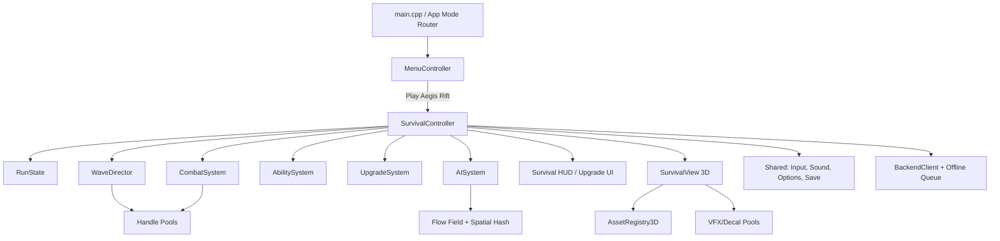
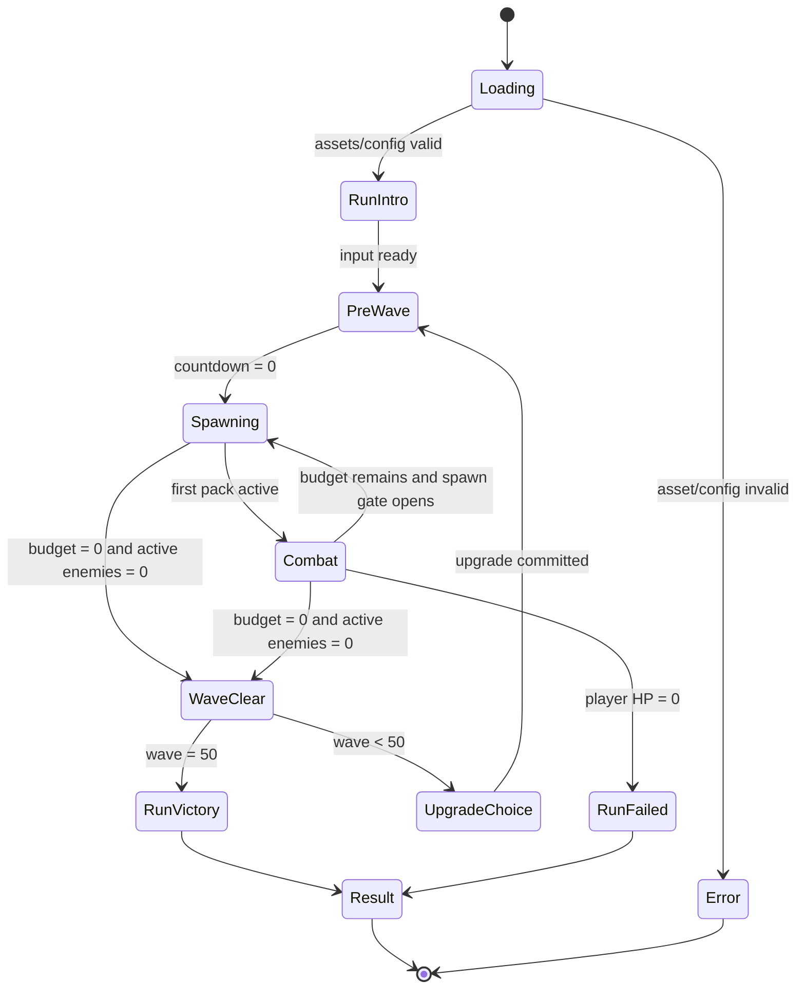
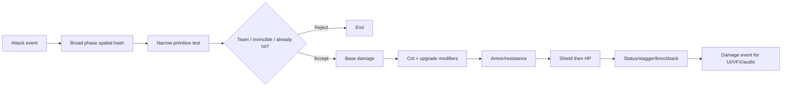
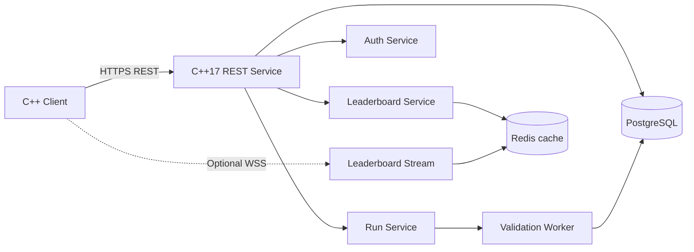
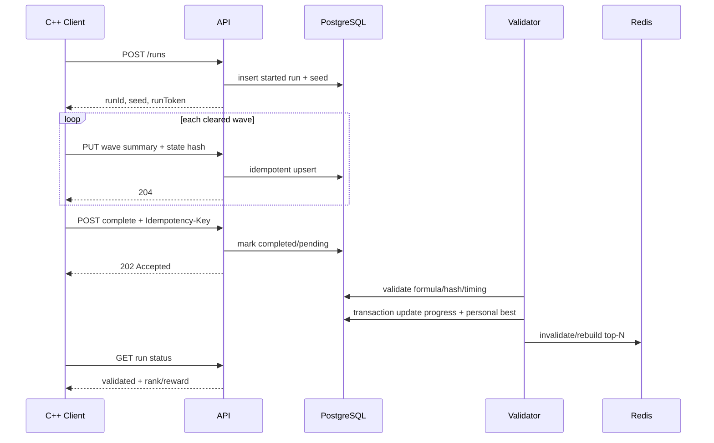

# TDD — Aegis Rift: 3D Wave Survival Roguelite

## 0. Thông tin tài liệu

| Thuộc tính | Giá trị |
|---|---|
| Phạm vi | Client 3D, gameplay runtime, dữ liệu, backend profile/leaderboard |
| Codebase đích | AppleKnightAdventure C++17 + raylib 6.0 |
| Backend đề xuất | REST/JSON: C++17 service + PostgreSQL + Redis |
| Chế độ mạng gameplay | MVP chạy local; backend không mô phỏng combat real-time |
| GDD | [GDD_3D_WAVE_SURVIVAL.md](./GDD_3D_WAVE_SURVIVAL.md) |
| Trạng thái | Architecture baseline v1.0 |

## 1. Mục tiêu, ràng buộc và quyết định kiến trúc

### 1.1 Mục tiêu

- Thêm minigame 3D mà không phá luồng campaign 2D hiện tại.
- Duy trì 60 FPS tại 1920×1080 với tối đa khoảng 120 enemy active.
- Wave, upgrade và balance data-driven; không hard-code 50 wave trong controller.
- Offline-first: chơi được khi không có backend; kết quả hợp lệ được xếp hàng submit sau.
- Leaderboard có version/season, idempotency và validation cơ bản.
- Tách resource GPU khỏi instance gameplay để pooling an toàn.

### 1.2 Ràng buộc từ codebase hiện tại

- Runtime là raylib `6.0`, đã có `BeginMode3D`, model animation và mesh instancing.
- `Entity`, `Character`, `CollisionSystem` hiện dùng `Vector2/Rectangle`, phù hợp platformer 2D nhưng không nên ép sang 3D.
- `SaveManager`, `SoundManager`, `InputController`, menu/options/font và asset sync có thể dùng chung.
- `ObjectPool<T>` hiện tại có `Release()` O(n) và reset object bằng phép gán; không thích hợp cho object chứa GPU handle hoặc hàng trăm instance thay đổi liên tục.
- Networking hiện tại là TCP host/client cho gameplay LAN; backend leaderboard là kênh HTTPS riêng, không thay thế `NetworkManager`.

### 1.3 Architecture Decision Records

| ID | Quyết định | Lý do |
|---|---|---|
| ADR-01 | Minigame là module trong cùng executable | Dùng chung menu, settings, save, audio; tránh hai installer |
| ADR-02 | Tạo model/runtime entity 3D riêng | Không làm `Vector2`/`Rectangle` lan thành abstraction nửa 2D nửa 3D |
| ADR-03 | Fixed simulation 60 Hz | Hit timing, spawn seed và replay ổn định hơn |
| ADR-04 | Kinematic XZ + primitive collision | Arena phẳng; không cần tích hợp physics engine nặng |
| ADR-05 | Data-oriented pools + generational handle | O(1) acquire/release, tránh dangling pointer |
| ADR-06 | REST là bắt buộc, WebSocket tùy chọn | Leaderboard/profile không cần kết nối real-time liên tục |
| ADR-07 | Backend xác thực run summary, không tuyên bố server-authoritative | Combat chạy local nên không thể chống cheat tuyệt đối |

## 2. Cấu trúc source/asset đề xuất

```text
AppleKnightAdventure/
  include/Survival3D/
    Model/          RunState, Combatant3D, AbilityRuntime, UpgradeState
    Controller/     SurvivalController, WaveDirector, CombatSystem
    View/           SurvivalView, SurvivalHUD, UpgradeView, BossWarningView
    Systems/        HandlePool, SpatialHash3D, NavigationField, VFXPool
    Data/           SurvivalConfig, ConfigLoader
    Net/            BackendClient, SubmissionQueue
  src/Survival3D/   mirror include tree
  assets/survival3d/
    config/         characters.json, enemies.json, waves.json, upgrades.json
    characters/     glb/iqm + textures
    enemies/
    bosses/
    arenas/
    vfx/
    ui/
backend/
  app/
    api/            auth, runs, leaderboard, profile
    domain/         validation, scoring, ranking
    db/             models, migrations, repositories
  tests/
  Dockerfile
  docker-compose.yml
```

Không đặt model 3D vào `assets/textures/player`; asset 2D và 3D có lifetime/import pipeline khác nhau.

## 3. Kiến trúc client tổng thể



### 3.1 App mode integration

Thêm `AppMode::Survival3D` vào router ở `main.cpp`. Menu có mục `RIFT SURVIVAL`, dẫn đến character select chỉ gồm Knight/Magic Caster. Khi mode kết thúc:

1. `SurvivalController::ShutdownRun()` release pool instance.
2. `AssetRegistry3D` giữ cache đến khi quay menu hoặc explicit shutdown.
3. Save local được ghi atomic qua `SaveManager`.
4. Submission được enqueue; network worker không block render thread.
5. Router trả về main menu, phục hồi BGM/menu view 2D.

### 3.2 Không tái sử dụng trực tiếp Entity 2D

Các type 3D tối thiểu:

```cpp
using EntityHandle = GenerationalHandle<uint32_t, uint16_t>;

struct Transform3D {
    Vector3 position;
    Quaternion rotation;
    Vector3 scale{1, 1, 1};
};

struct KinematicBody3D {
    Vector3 velocity;
    float radius;
    float height;
    uint32_t collisionMask;
};

struct Combatant3D {
    float hp;
    float maxHp;
    float armor;
    float moveSpeed;
    Team team;
    uint32_t statusFlags;
};

struct AnimationState3D {
    AnimationClipId clip;
    float normalizedTime;
    float playbackRate;
    uint8_t phaseBucket;
};
```

`EntityHandle` được truyền giữa system thay cho raw pointer. Handle chứa index + generation; pool từ chối handle cũ sau khi slot được tái sử dụng.

## 4. Game state machine



### 4.1 State ownership

| State | Update gameplay | Update UI | Timer run | Cho phép pause |
|---|---|---|---|---|
| Loading | Không | Loading | Không | Không |
| RunIntro/PreWave | Player movement tùy config | Banner | Không | Có |
| Spawning/Combat | Có | HUD | Có | Có |
| WaveClear | Không | Stats | Không | Không |
| UpgradeChoice | Không | 3 cards | Không | Không |
| RunVictory/Failed | Không | Result | Không | Không |

Chuyển state chỉ qua `RequestTransition()`, commit ở cuối fixed tick để tránh đổi collection trong lúc iterate.

## 5. Fixed timestep và gameplay loop

```cpp
constexpr double FIXED_DT = 1.0 / 60.0;
accumulator += std::min(frameDt, 0.100);

PollInputOncePerFrame();
while (accumulator >= FIXED_DT) {
    inputBuffer.ConsumeForTick();
    stateMachine.PreUpdate(FIXED_DT);
    waveDirector.Update(FIXED_DT);
    aiSystem.Update(FIXED_DT);
    abilitySystem.Update(FIXED_DT);
    movementSystem.Update(FIXED_DT);
    spatialHash.RebuildDynamicBuckets();
    combatSystem.Resolve(FIXED_DT);
    statusSystem.Update(FIXED_DT);
    cleanupSystem.ReleaseExpired();
    stateMachine.PostUpdate(FIXED_DT);
    accumulator -= FIXED_DT;
}

const float alpha = float(accumulator / FIXED_DT);
survivalView.RenderInterpolated(alpha);
```

- Không chạy quá 6 catch-up tick/frame; nếu vượt, ghi telemetry và drop accumulator để tránh spiral of death.
- Presentation hit stop không dừng wave timer/backend time. Nó giữ pose/camera 30–110 ms và có thể giảm local animation time scale; simulation vẫn xử lý an toàn.
- RNG gameplay không được gọi từ render/VFX.

## 6. Dữ liệu và config

### 6.1 Config versioning

Mọi run lưu:

- `gameBuildVersion`
- `balanceConfigVersion`
- `contentHash`
- `seed`
- `difficulty`
- `characterId`

Backend chỉ xếp hạng run theo season/config tương thích.

### 6.2 Ví dụ character config

```json
{
  "schemaVersion": 1,
  "characters": {
    "knight": {
      "maxHp": 140,
      "moveSpeed": 5.2,
      "armor": 0.12,
      "capsule": { "radius": 0.42, "height": 1.75 },
      "abilities": ["violet_edge", "aegis_counter", "shield_rush", "bastion_breaker"]
    }
  }
}
```

### 6.3 Wave config

`waves.json` chỉ chứa mix, modifier, boss ID và override. Scaling lấy từ `balance.json` để designer chỉnh công thức mà không sửa 50 entry.

```json
{
  "wave": 21,
  "budgetMultiplier": 1.0,
  "mix": { "swarm": 0.45, "ranger": 0.40, "tanker": 0.15 },
  "modifiers": ["hex_binder_enabled"],
  "arenaVariant": "rift_coliseum_c"
}
```

Loader validate bằng schema nội bộ: tổng mix gần 1.0, ID tồn tại, cooldown/damage không âm, boss wave đúng 10/20/30/40/50. Lỗi config làm mode không start và hiện message, không crash toàn app.

## 7. Wave Director và deterministic RNG

### 7.1 RNG streams

Một seed server/local được tách thành stream độc lập:

```text
spawnRng  = Hash(seed, "spawn")
offerRng  = Hash(seed, "upgrade")
affixRng  = Hash(seed, "affix")
lootRng   = Hash(seed, "loot")
vfxRng    = non-deterministic presentation RNG
```

Thêm VFX không làm thay đổi upgrade offer. Dùng PCG32/xoshiro với implementation cố định trong repo, không dựa vào `std::rand()`.

### 7.2 Director algorithm

1. Tính `budget`, `activeCap`, role mix và elite chance từ wave/config.
2. Chọn pack template phù hợp số budget còn lại.
3. Chấm điểm spawn gate theo khoảng cách player, camera visibility, mật độ gate và đường đi.
4. Reserve slot trong enemy pool trước khi bật warning rune.
5. Sau telegraph 0.7 s, activate enemy; nếu pool/cap đầy, giữ request trong queue.
6. Wave clear khi `remainingBudget==0`, `pendingSpawn==0`, `activeEnemy==0`.

Không dùng số entity trong vector làm điều kiện clear vì pooled object vẫn tồn tại.

## 8. AI, navigation và avoidance

### 8.1 Navigation

- Arena bake thành nav grid 2D trên XZ, cell 0.5 m.
- Swarm dùng flow field hướng tới player, rebuild tối đa 5 Hz hoặc khi player đổi cell.
- Ranger/Tanker dùng A* tới tactical slot; path cache invalidated khi hazard/obstacle đổi.
- Local avoidance dùng separation + collision projection; không dùng RVO đầy đủ ở MVP.
- Enemy không cập nhật path mỗi frame.

### 8.2 AI LOD

| Khoảng cách camera/player | Logic rate | Animation | Ghi chú |
|---|---:|---|---|
| <12 m | 60 Hz combat, 20 Hz path | full | hit/telegraph chính xác |
| 12–25 m | 30 Hz combat, 10 Hz path | 8 phase buckets | interpolate movement |
| >25 m | 15 Hz intent, 5 Hz path | LOD2/billboard | vẫn cập nhật projectile warning |

Boss luôn ở tier gần. Attack contact và projectile collision luôn fixed 60 Hz dù intent AI ở rate thấp.

### 8.3 Behavior Tree implementation

BT trong GDD được compile thành node array, không cấp phát heap mỗi tick:

```cpp
enum class NodeType : uint8_t { Selector, Sequence, Condition, Action, Cooldown };
struct BTNode { NodeType type; uint16_t firstChild; uint8_t childCount; uint16_t dataId; };
struct Blackboard {
    EntityHandle target;
    Vector3 desiredPosition;
    float distanceToTarget;
    bool hasLineOfSight;
    bool isStaggered;
};
```

Blackboard nằm trong enemy pool. LOS query được budget theo frame và cache 100–200 ms; attack frame luôn xác nhận LOS lại.

## 9. Collision, hitbox và combat

### 9.1 Primitive collision

- Body: capsule đứng trên Y.
- Melee hit: sphere/capsule/sector sample trên XZ.
- AoE: cylinder/sphere.
- Projectile: sphere với swept segment để tránh tunneling.
- Arena wall: AABB/convex boxes đơn giản.

`SpatialHashXZ` cell size 2 m. Mỗi combat query chỉ lấy bucket giao với hit volume, giảm kiểm tra từ O(n²) xuống gần O(n+k).

### 9.2 Damage pipeline



Mỗi activation có `attackInstanceId`; target chỉ nhận một hit cho mỗi ID trừ skill ghi rõ multi-hit. Damage calculation dùng float nội bộ, round khi hiển thị.

### 9.3 Ability phases

```cpp
struct AbilitySpec {
    float startup;
    float active;
    float recovery;
    float cooldown;
    HitShapeSpec hitShape;
    std::vector<EffectSpec> effects;
    AnimationClipId clip;
};
```

State: `Ready → Startup → Active → Recovery → Cooldown`. Dash/parry có interrupt policy data-driven. Animation event chỉ phát VFX/SFX; gameplay hit window lấy từ `AbilitySpec`, không phụ thuộc frame render.

## 10. Rendering 3D và animation

### 10.1 Render order

1. Shadow/depth approximation nếu bật.
2. Opaque arena static meshes.
3. Opaque characters/enemies.
4. Alpha-tested props/hair.
5. Transparent VFX từ back-to-front theo emitter group.
6. Ground decals/telegraphs.
7. End `Mode3D`, render HUD 2D.
8. Modal UI/post-process nhẹ.

MVP ưu tiên một directional light, baked AO, rim-light shader và blob shadow. Không dùng nhiều point light thật cho từng projectile; emissive/VFX giả ánh sáng.

### 10.2 Asset ownership

`AssetRegistry3D` là owner duy nhất của `Model`, `Texture2D`, `Shader`, `Material`. Pool instance chỉ giữ ID. Khi release enemy không unload model/texture.

```cpp
struct RenderInstance3D {
    ModelAssetId model;
    MaterialVariantId material;
    Transform3D previous;
    Transform3D current;
    AnimationState3D animation;
    uint8_t lod;
    bool visible;
};
```

### 10.3 Skeletal animation strategy

`UpdateModelAnimation` thay đổi pose của model; 120 pose độc lập mỗi frame có chi phí lớn. Chiến lược:

- Player/boss/15 enemy gần nhất: pose riêng, blend clip đầy đủ.
- Enemy cùng archetype ở mid range: lượng tử normalized time thành 8 bucket; update pose một lần/bucket rồi vẽ các transform thuộc bucket.
- Far LOD: mesh rigid đơn giản hoặc 8-direction flipbook billboard.
- `DrawMeshInstanced` dùng cho props tĩnh, warning rune, debris rigid và far rigid LOD; không giả định instancing skeletal miễn phí.
- Animation culling: entity ngoài frustum chỉ advance normalized time, không update bone matrices.

### 10.4 Draw call/material policy

- Tối đa 2 material/body character, 1 material weapon.
- Swarm/Ranger/Tanker dùng texture atlas theo archetype/variant.
- Gộp arena theo material; props lặp dùng instancing.
- Target tại peak: ≤250 draw calls, ≤3.5M visible triangles LOD-adjusted ở 1080p.
- Transparent particle texture dùng 2–4 atlas thay vì texture riêng từng effect.

## 11. VFX, decals, camera và hit stop

### 11.1 Event-driven presentation

Gameplay phát immutable event:

```cpp
struct ImpactEvent {
    Vector3 position;
    Vector3 normal;
    ImpactTier tier;
    DamageElement element;
    EntityHandle source;
    EntityHandle target;
};
```

VFX/audio/camera subscribe event nhưng không thay đổi damage. Event queue có capacity; khi overflow, bỏ cosmetic tier thấp trước, không bỏ boss warning.

### 11.2 Camera impulse

Camera shake là tổng impulse đã clamp:

```text
translation ≤ 0.22 m (normal), 0.45 m (ultimate/boss)
rotation    ≤ 1.2° normal, 2.5° boss
frequency   18–30 Hz, exponential decay
```

Options multiplier áp cuối pipeline. Damage direction indicator không phụ thuộc camera shake.

## 12. Object pooling và memory

### 12.1 Pool capacities

| Pool | Prewarm | Hard cap | Khi hết slot |
|---|---:|---:|---|
| Enemy instances | 144 | 192 | director hoãn spawn |
| Gameplay projectiles | 512 | 768 | từ chối cosmetic/multi-shot phụ trước |
| Hit volumes | 256 | 384 | reuse theo tick, log warning |
| VFX emitters | 256 | 384 | drop tier thấp |
| Particles | 8,192 | 12,288 | overwrite particle cũ tier thấp |
| Decals | 192 | 256 | recycle decal xa/cũ nhất |
| Damage numbers | 128 | 192 | gộp damage cùng target/100 ms |

Pool allocate một lần lúc loading. Không gọi `new/delete` trong Combat/Spawning. Free list O(1); release tăng generation.

### 12.2 Memory budget mục tiêu

| Nhóm | Budget |
|---|---:|
| Character/enemy models + animations | 350 MB |
| Textures resident | 450 MB |
| Arena + props | 200 MB |
| VFX/UI/audio resident | 200 MB |
| Runtime pools/nav/temp | 100 MB |
| Tổng mục tiêu | ≤1.3 GB, peak ≤1.6 GB |

Texture mipmap bắt buộc. Boss model/texture có thể preload trước boss wave 8/18/28/38/48 và unload boss cũ sau transition nếu memory pressure cao.

## 13. Performance budget và profiling

| Hạng mục | Budget/frame tại 60 FPS |
|---|---:|
| Fixed gameplay + wave | 1.5 ms |
| AI/path/avoidance | 2.5 ms |
| Collision/combat | 2.0 ms |
| Animation CPU | 2.5 ms |
| Render submission | 1.5 ms |
| GPU opaque/shadow | 3.0 ms |
| GPU VFX/post/UI | 2.0 ms |
| Headroom/OS | ~1.6 ms |

Telemetry debug overlay:

- FPS/CPU/GPU frame time.
- active/pending enemy, projectile, VFX, draw calls, visible tris.
- pool high-water mark và denied acquire.
- AI update counts theo LOD.
- spatial query count/candidate count.
- wave RNG seed/config hash.

Benchmark bắt buộc: 120 Swarm, 20 Ranger, 8 Tanker, 300 projectile, 4,000 particle và 100 decal.

## 14. Client UI architecture

```text
SurvivalHUD
  PlayerStatusPanel (portrait, HP, shield, ultimate)
  SkillCooldownBar
  WaveTracker
  RadarView
  BuffStrip
  BossBar (HP + phase pips + mechanic meter)
  DirectionalWarningLayer
  DamageNumberLayer

SurvivalModalLayer
  UpgradeChoiceView
  Pause/Options (reuse shared options)
  BossIntroView
  RunResultView
```

UI dùng virtual canvas 1280×720 và safe margins; layout scale theo min(screenW/1280, screenH/720). Text đo bằng `MeasureTextEx` trước khi chốt box. Card description wrap theo word và có minimum font size; không scale riêng box/text gây tràn.

Radar chuyển XZ world-space quanh player thành circle-space, cull chấm > radar range và cluster Swarm xa để giảm noise.

## 15. Save local và liên kết game chính

Mở rộng `save.json` nhưng giữ backward compatibility:

```json
{
  "survival3d": {
    "schemaVersion": 1,
    "highestWave": { "knight": 37, "magic_caster": 24 },
    "bestScore": { "knight": 182450, "magic_caster": 99800 },
    "bestClearTimeMs": {},
    "bossFirstKills": ["brood_warden", "hexeye"],
    "unlockedCosmetics": ["rift_title_brood"],
    "lifetime": { "runs": 12, "kills": 4820, "bosses": 9 },
    "pendingSubmissionIds": []
  }
}
```

- Ghi bằng temp + backup + rename như `SaveManager` hiện tại.
- Run active có checkpoint kỹ thuật sau mỗi wave để crash recovery, nhưng recovered run gắn cờ `unranked` nhằm tránh save scumming.
- Coin reward commit một lần theo `runId`; lưu set/LRU 100 run ID đã claim.
- Access/refresh token không lưu plaintext trong `save.json`; dùng OS credential store. Guest/offline dùng local player ID và liên kết account sau.

## 16. Backend architecture

### 16.1 Phạm vi backend

Backend chịu trách nhiệm:

- account/guest identity;
- profile và tiến trình minigame;
- cấp seed/config cho ranked run;
- nhận wave summaries/run result;
- validation, chống duplicate và cập nhật leaderboard;
- trả top rank/personal rank;
- telemetry/ban cơ bản.

Backend **không** mô phỏng từng frame combat ở MVP. Vì client local có thể bị sửa, validation chỉ tăng chi phí cheat chứ không bảo đảm chống cheat tuyệt đối.

### 16.2 Thành phần



- C++17 REST service: API stateless; bản local dùng Winsock + JSON persistence, production dùng TLS reverse proxy và PostgreSQL adapter.
- PostgreSQL: source of truth.
- Redis: top-N cache, rate limit, pub/sub; hệ thống vẫn đúng nếu Redis mất.
- Background worker C++: validation và telemetry aggregation qua job queue riêng.

## 17. Database schema

PostgreSQL DDL rút gọn:

```sql
CREATE EXTENSION IF NOT EXISTS pgcrypto;

CREATE TABLE players (
    id UUID PRIMARY KEY DEFAULT gen_random_uuid(),
    external_subject TEXT UNIQUE,
    display_name VARCHAR(24) NOT NULL,
    status VARCHAR(16) NOT NULL DEFAULT 'active',
    created_at TIMESTAMPTZ NOT NULL DEFAULT now(),
    last_seen_at TIMESTAMPTZ NOT NULL DEFAULT now()
);

CREATE TABLE player_progress (
    player_id UUID PRIMARY KEY REFERENCES players(id) ON DELETE CASCADE,
    highest_wave SMALLINT NOT NULL DEFAULT 0 CHECK (highest_wave BETWEEN 0 AND 50),
    best_score BIGINT NOT NULL DEFAULT 0,
    best_survival_ms BIGINT NOT NULL DEFAULT 0,
    best_clear_ms BIGINT,
    runs_started INTEGER NOT NULL DEFAULT 0,
    runs_completed INTEGER NOT NULL DEFAULT 0,
    lifetime_kills BIGINT NOT NULL DEFAULT 0,
    bosses_killed INTEGER NOT NULL DEFAULT 0,
    survival_currency INTEGER NOT NULL DEFAULT 0,
    updated_at TIMESTAMPTZ NOT NULL DEFAULT now()
);

CREATE TABLE seasons (
    id UUID PRIMARY KEY DEFAULT gen_random_uuid(),
    name VARCHAR(64) NOT NULL,
    config_version VARCHAR(32) NOT NULL,
    starts_at TIMESTAMPTZ NOT NULL,
    ends_at TIMESTAMPTZ,
    is_ranked BOOLEAN NOT NULL DEFAULT TRUE
);

CREATE TABLE survival_runs (
    id UUID PRIMARY KEY,
    player_id UUID NOT NULL REFERENCES players(id),
    season_id UUID NOT NULL REFERENCES seasons(id),
    idempotency_key UUID NOT NULL,
    character_id VARCHAR(32) NOT NULL,
    difficulty VARCHAR(16) NOT NULL,
    seed BIGINT NOT NULL,
    build_version VARCHAR(32) NOT NULL,
    config_version VARCHAR(32) NOT NULL,
    content_hash CHAR(64) NOT NULL,
    status VARCHAR(20) NOT NULL DEFAULT 'started',
    validation_status VARCHAR(20) NOT NULL DEFAULT 'pending',
    highest_wave SMALLINT NOT NULL DEFAULT 0,
    score BIGINT NOT NULL DEFAULT 0,
    survival_ms BIGINT NOT NULL DEFAULT 0,
    damage_taken INTEGER NOT NULL DEFAULT 0,
    kills INTEGER NOT NULL DEFAULT 0,
    bosses_killed SMALLINT NOT NULL DEFAULT 0,
    final_state_hash CHAR(64),
    started_at TIMESTAMPTZ NOT NULL DEFAULT now(),
    completed_at TIMESTAMPTZ,
    UNIQUE(player_id, idempotency_key)
);

CREATE TABLE run_wave_logs (
    run_id UUID NOT NULL REFERENCES survival_runs(id) ON DELETE CASCADE,
    wave SMALLINT NOT NULL CHECK (wave BETWEEN 1 AND 50),
    clear_ms INTEGER NOT NULL CHECK (clear_ms > 0),
    kills INTEGER NOT NULL CHECK (kills >= 0),
    damage_dealt BIGINT NOT NULL CHECK (damage_dealt >= 0),
    damage_taken INTEGER NOT NULL CHECK (damage_taken >= 0),
    upgrade_id VARCHAR(64),
    upgrade_stack SMALLINT,
    state_hash CHAR(64) NOT NULL,
    event_summary JSONB NOT NULL DEFAULT '{}',
    received_at TIMESTAMPTZ NOT NULL DEFAULT now(),
    PRIMARY KEY(run_id, wave)
);

CREATE TABLE player_leaderboard_bests (
    player_id UUID NOT NULL REFERENCES players(id) ON DELETE CASCADE,
    season_id UUID NOT NULL REFERENCES seasons(id) ON DELETE CASCADE,
    character_id VARCHAR(32) NOT NULL,
    difficulty VARCHAR(16) NOT NULL,
    best_score BIGINT NOT NULL DEFAULT 0,
    best_score_run_id UUID REFERENCES survival_runs(id),
    highest_wave SMALLINT NOT NULL DEFAULT 0,
    best_survival_ms BIGINT NOT NULL DEFAULT 0,
    best_survival_run_id UUID REFERENCES survival_runs(id),
    best_clear_ms BIGINT,
    best_clear_run_id UUID REFERENCES survival_runs(id),
    updated_at TIMESTAMPTZ NOT NULL DEFAULT now(),
    PRIMARY KEY(player_id, season_id, character_id, difficulty)
);

CREATE INDEX idx_runs_player_started
    ON survival_runs(player_id, started_at DESC);
CREATE INDEX idx_runs_validation
    ON survival_runs(validation_status, completed_at)
    WHERE status = 'completed';
CREATE INDEX idx_lb_score
    ON player_leaderboard_bests(season_id, character_id, difficulty, best_score DESC, highest_wave DESC);
CREATE INDEX idx_lb_survival
    ON player_leaderboard_bests(season_id, character_id, difficulty, highest_wave DESC, best_survival_ms DESC);
CREATE INDEX idx_lb_clear
    ON player_leaderboard_bests(season_id, character_id, difficulty, best_clear_ms ASC)
    WHERE best_clear_ms IS NOT NULL;
```

`run_wave_logs` có thể partition theo tháng khi dữ liệu lớn. Raw input replay không giữ vô hạn; summary giữ 180 ngày, best run giữ lâu dài.

## 18. REST API

Base path: `/v1`. Mọi mutation dùng HTTPS, bearer access token và request ID.

### 18.1 Identity/profile

| Method | Endpoint | Chức năng |
|---|---|---|
| POST | `/auth/guest` | Tạo guest identity/device link |
| POST | `/auth/refresh` | Đổi refresh token lấy access token |
| GET | `/players/me` | Profile + progress tổng |
| GET | `/players/me/runs?limit=20` | Lịch sử run |

### 18.2 Run lifecycle

| Method | Endpoint | Chức năng |
|---|---|---|
| POST | `/runs` | Bắt đầu ranked run, server cấp seed/token |
| PUT | `/runs/{runId}/waves/{wave}` | Upsert summary một wave, idempotent |
| POST | `/runs/{runId}/complete` | Submit result cuối |
| POST | `/runs/{runId}/abandon` | Đánh dấu bỏ run |
| GET | `/runs/{runId}` | Trạng thái validation/result |

Request start:

```json
{
  "characterId": "knight",
  "difficulty": "standard",
  "buildVersion": "1.8.0",
  "configVersion": "s1.3",
  "contentHash": "sha256..."
}
```

Response:

```json
{
  "runId": "2a3b...",
  "seed": 7812489031,
  "seasonId": "65ac...",
  "runToken": "short-lived-signed-token",
  "serverStartedAt": "2026-08-21T10:00:00Z",
  "ranked": true
}
```

Complete request:

```json
{
  "highestWave": 37,
  "score": 182450,
  "survivalMs": 1684320,
  "kills": 1148,
  "bossesKilled": 3,
  "damageTaken": 624,
  "finalStateHash": "sha256...",
  "waveHashChain": "sha256..."
}
```

Response dùng `202 Accepted` khi cần async validation; client poll `GET /runs/{id}`.

### 18.3 Leaderboard

| Method | Endpoint | Chức năng |
|---|---|---|
| GET | `/leaderboards/{board}` | Top entries, board=`score|survival|fastest_clear` |
| GET | `/leaderboards/{board}/me` | Rank cá nhân + lân cận |

Ví dụ:

```text
GET /v1/leaderboards/score?season=current&character=knight&difficulty=standard&limit=50&cursor=...
```

Response:

```json
{
  "board": "score",
  "season": "s1",
  "entries": [
    { "rank": 1, "player": "Aegis", "score": 948200, "wave": 50, "timeMs": 2280120 }
  ],
  "nextCursor": null,
  "generatedAt": "2026-08-21T10:05:00Z"
}
```

- Cursor pagination, `limit` tối đa 100.
- Cache top 100 trong Redis 10–30 s.
- Personal rank query đi PostgreSQL hoặc sorted set Redis đã rebuild từ validated best.
- Chỉ giữ best của mỗi player/filter để một người không chiếm nhiều dòng.

### 18.4 WebSocket tùy chọn

`WSS /v1/live/leaderboards/{board}` chỉ push event `rank_changed` khi client đang mở leaderboard. Gameplay không phụ thuộc socket; reconnect bằng exponential backoff và fallback REST.

## 19. Submit/validation flow



### 19.1 Validation rules

- Build/config/content hash nằm trong allowlist season.
- Wave logs liên tục từ 1 đến highest wave; không trùng/skipped.
- Kill range phù hợp deterministic budget ± tolerance do summon/split.
- Damage/HP/upgrade stacks nằm trong giới hạn config.
- Clear time không thấp hơn theoretical minimum theo spawn telegraph/travel.
- Score được **server tính lại**, không tin trực tiếp score client.
- Hash chain: `H_n = SHA256(H_(n-1) || canonicalWaveSummary_n || nonce)`.
- Rate limit: start 10/phút/device, complete 5/phút/player, leaderboard 60/phút/IP.
- Run recovered từ local checkpoint hoặc debug build luôn `unranked`.

Client-authoritative combat vẫn có thể bị memory edit. Nếu cần mức cạnh tranh cao hơn, phase sau phải gửi compressed input replay và có headless deterministic validator; không nên quảng bá hệ thống hiện tại là chống cheat tuyệt đối.

## 20. Backend client, offline và lỗi mạng

`BackendClient` chạy worker thread; main thread trao đổi qua lock-free/bounded queue hoặc mutex queue ngắn. Không gọi HTTP đồng bộ trong Update/Render.

```cpp
struct PendingSubmission {
    Uuid idempotencyKey;
    Uuid runId;
    std::string endpoint;
    std::string payload;
    int retryCount;
    int64_t nextAttemptUnixMs;
};
```

- Timeout connect 3 s, total 8 s.
- Retry mutation idempotent với exponential backoff 2 s → 5 min, jitter ±20%.
- HTTP 4xx validation không retry vô hạn; hiển thị `UNRANKED` và lý do thân thiện.
- HTTP 5xx/network enqueue disk queue atomic, tối đa 50 run; bỏ entry cũ không phải personal best trước.
- Menu hiển thị trạng thái `Offline`, `Syncing`, `Ranked`, `Rejected`.
- Clock local không dùng làm nguồn truth cho ranked timer; fixed tick count + server start bounds.

## 21. Security và privacy

- TLS bắt buộc; certificate validation không được tắt trong release.
- Access token 15 phút, refresh token rotation; token không ghi log.
- Display name sanitize/normalize Unicode, 3–24 ký tự; profanity/moderation tùy scope.
- Parameterized SQL/ORM, migration có review.
- Secret/config qua environment variables, không commit `.env`.
- Audit log cho ban/unban/score invalidation.
- Thu thập tối thiểu: player ID, gameplay stats, build/device class; không cần địa chỉ chính xác.
- Cho phép xóa account và history theo policy triển khai.

## 22. Observability backend

Metrics:

- request latency/error theo endpoint/status;
- runs started/completed/validated/rejected;
- rejection reason distribution;
- queue lag validator;
- leaderboard cache hit rate;
- completion rate từng wave/character/difficulty/config;
- median clear time, pick rate và win rate từng upgrade.

Structured log chứa `requestId`, `playerId` đã hash, `runId`, `buildVersion`; không log token/payload nhạy cảm. Alert khi validation queue >5 phút hoặc API error >2% trong 5 phút.

## 23. Testing strategy

### 23.1 Client unit/property tests

- Scaling HP/damage/budget monotonic từ wave 1–50 và không vượt cap.
- Cùng seed/config tạo cùng pack order và upgrade offers.
- Pool handle cũ invalid sau release/reacquire; acquire/release O(1).
- Damage pipeline áp modifier theo thứ tự cố định.
- Upgrade exclusion/stack cap/pity hoạt động.
- Wave clear không xảy ra khi pending spawn còn tồn tại.
- Serialization run summary canonical và hash chain ổn định.

### 23.2 Client integration tests

- Headless run 50 wave với bot, không render, không leak slot.
- Pause/Upgrade không tăng timer.
- Shutdown giữa HTTP request không treo app.
- Chuyển Campaign → Survival3D → Menu 20 lần không tăng GPU memory bất thường.
- 1280×720, 1920×1080, ultrawide: HUD/card không tràn.

### 23.3 Performance tests

- Soak 30 phút ở active cap.
- Spawn/despawn 100,000 pooled entity trong test process.
- Benchmark từng LOD, particle cap và transparent overdraw.
- Frame-time percentile mục tiêu: P50 <16.6 ms, P95 <20 ms, P99 <28 ms; không hitch >100 ms sau preload.

### 23.4 Backend tests

- API contract/OpenAPI; auth/permission; idempotency duplicate.
- Transaction race: hai complete request không cộng reward hai lần.
- Leaderboard tie-break chính xác.
- Property test score recomputation và invalid payload bounds.
- Load test top leaderboard, run start/complete và validator queue.
- Migration forward/rollback trên snapshot staging.

## 24. Build, deployment và configuration

### 24.1 Client

- CMake thêm source `Survival3D`; config JSON/model nằm dưới root `assets` để `SyncAssets` hiện tại tự copy.
- Release build có feature flag `ENABLE_SURVIVAL3D` và `ENABLE_ONLINE_BACKEND`.
- Backend base URL compile theo environment/channel, không hard-code localhost trong release.
- HTTP library đề xuất: libcurl với TLS; wrapper chỉ expose async request/response DTO.

### 24.2 Backend

- Local dev: Docker Compose gồm API, PostgreSQL, Redis, worker.
- Production: container stateless sau reverse proxy/load balancer; PostgreSQL managed + backup PITR.
- Migration chạy job riêng trước rollout; API tương thích ít nhất hai client version đang active.
- Blue/green hoặc rolling deploy; season/config publish là thao tác riêng với code deploy.

## 25. Roadmap triển khai đề xuất

| Milestone | Nội dung | Exit criteria |
|---|---|---|
| M1 — 3D vertical slice | arena, camera, Knight, 20 Swarm, basic attack | 60 FPS, combat readable |
| M2 — Systems | pools, spatial hash, director, upgrade UI | chạy 10 wave không allocation gameplay |
| M3 — Content alpha | Caster, 3 enemy, boss wave 10/20 | loop 20 wave hoàn chỉnh |
| M4 — 50-wave beta | 5 boss, full pool upgrade, HUD/audio | wave 1–50 playable |
| M5 — Online services | profile, submit, validation, leaderboard | idempotent, offline queue hoạt động |
| M6 — Polish | LOD, performance, accessibility, balance telemetry | đạt frame budget/QA matrix |

## 26. Definition of Done

- Minigame mở/thoát từ main menu không làm hỏng campaign/save hiện có.
- Hai character, ba enemy và năm boss đáp ứng spec GDD.
- 50 wave data-driven và deterministic theo seed/config.
- Upgrade 1-trong-3 xuất hiện sau wave 1–49; boss reward đúng rarity.
- Không cấp phát heap trong hot path Combat/Spawn/VFX sau preload.
- Benchmark peak đạt frame-time target và không vượt hard pool cap trong content chuẩn.
- Local save backward compatible, reward idempotent.
- API, schema, validation, top rank và personal rank có automated test.
- Mất mạng không làm mất run hoặc block gameplay; run sync lại khi có mạng.
- Documentation/config hash/version được đóng gói cùng release.
