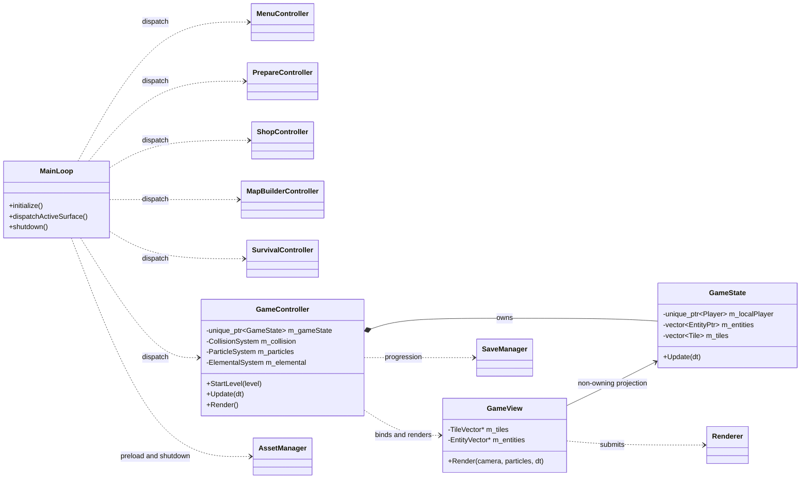
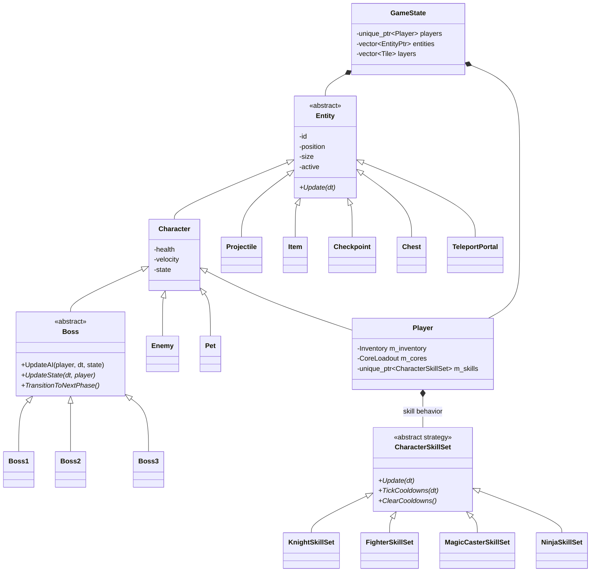
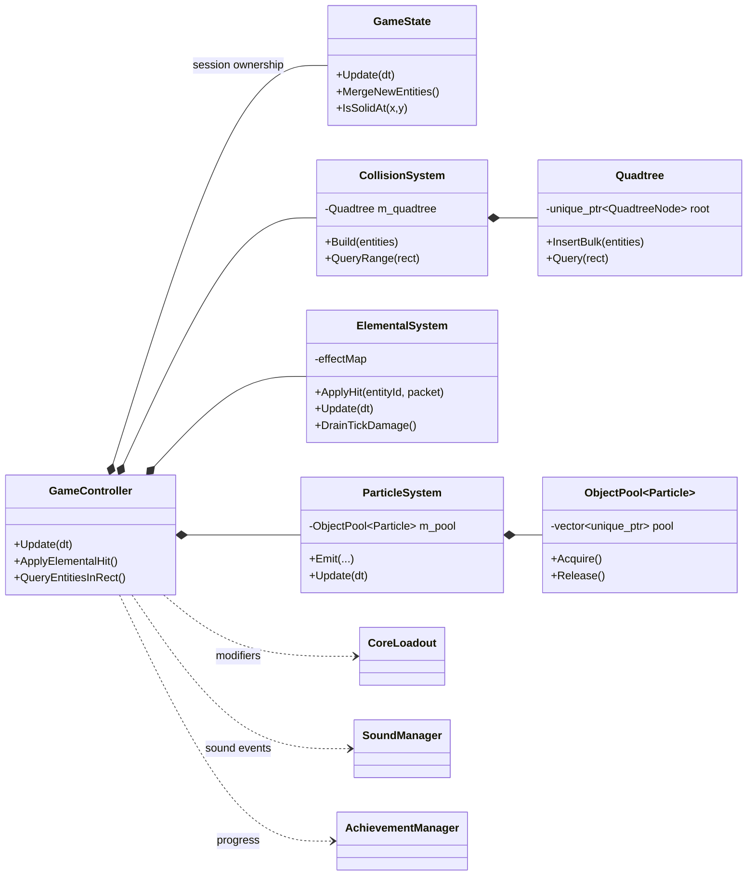
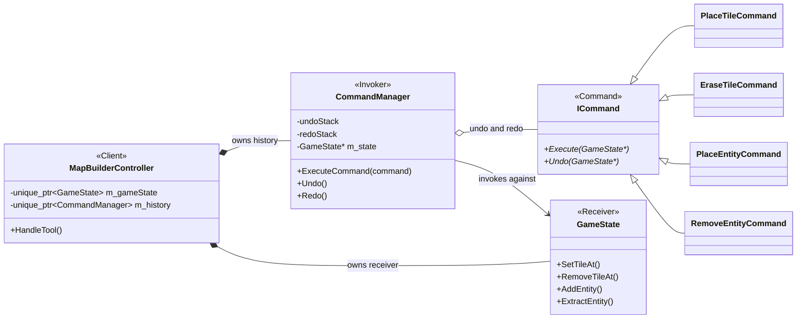
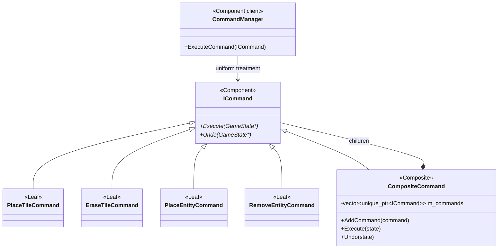
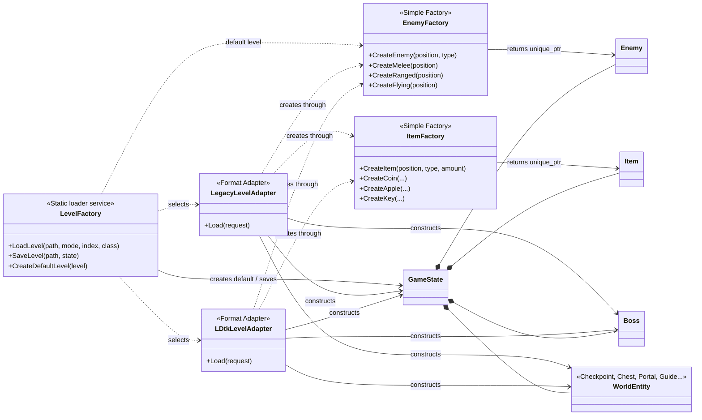
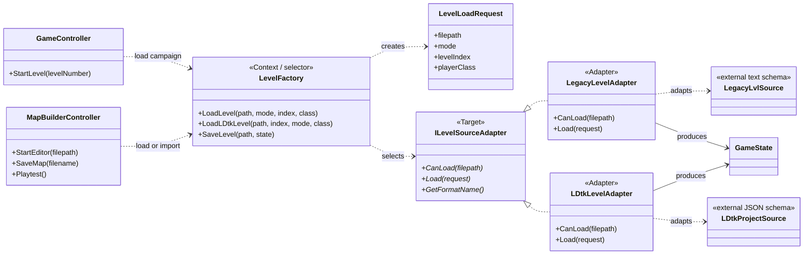
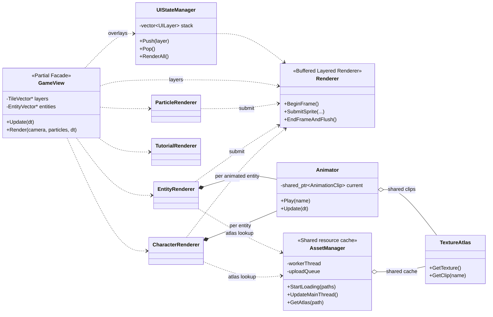
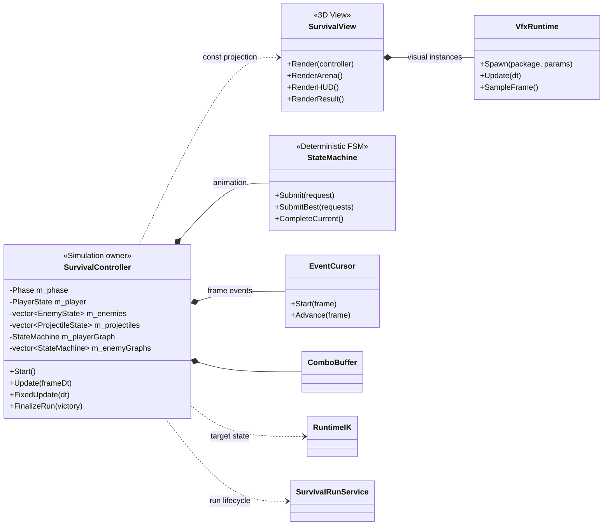
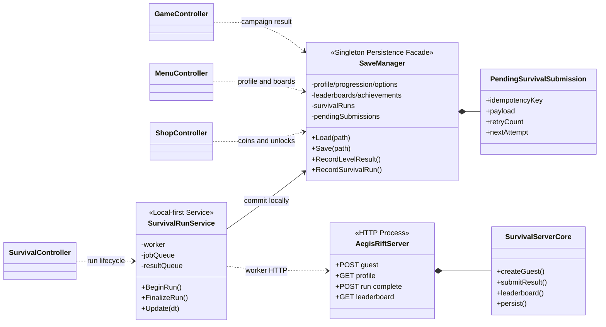

# APPLE KNIGHT ADVENTURE

## Software Architecture and Design Report

**Course:** Software Design Patterns - CS202  
**Class group:** Group 55  
**University:** University of Science - VNUHCM  
**Faculty:** Faculty of Information Technology  
**Prepared:** Ho Chi Minh City, August 2026

**Analysis basis:** The complete current project source tree was reviewed, including the 2D Adventure client, application shell, Map Builder, rendering and UI stack, Survival3D mode, persistence layer, and separately built Survival3D HTTP backend. The report is organized around the implemented design rather than repository history.  
**Verification basis:** Static dependency and call-flow tracing across 185 project C++ header/source files, CMake reconfiguration, and successful builds of both `AppleKnightAdventure.exe` and `AegisRiftServer.exe`.

## Group Information

| Student ID | Full name |
|---|---|
| 25125074 | Nguyễn Anh Kiệt |
| 25125037 | Nguyễn Trọng Tiến |

## Table of Contents

1. Executive Summary
2. Project Scope and Source Coverage
3. Architectural Drivers and Design Principles
4. System Architecture and Runtime Composition
5. Adventure Domain Design
6. Gameplay Systems and Collaboration
7. Map Builder and Object Creation Design
8. Rendering, Animation, and UI Architecture
9. Survival3D Architecture
10. Persistence and Online Service Design
11. Applied Design Patterns
12. Design Reasoning and Consequences
13. End-to-End Runtime Flows
14. Build and Reproduction
15. Conclusion
16. Source Evidence Index

<!-- pdf-body -->

# 1. Executive Summary

Apple Knight Adventure is a C++17 game built with raylib. It is a collection of cooperating runtime surfaces: a six-level 2D Adventure campaign, a preparation and progression shell, a custom Map Builder with reversible editing and playtesting, a separate fixed-step 3D survival game, and an optional local HTTP leaderboard service. These surfaces share assets, audio, display management, achievements, and JSON persistence, but each owns a different part of the gameplay lifecycle.

The dominant architectural style is **MVC-inspired orchestration**. Model classes own gameplay state and rules. Controller classes interpret input and establish update order. View classes translate model snapshots and non-owning model references into raylib draw commands. The design deliberately remains pragmatic: the boundary is strong enough to identify ownership and responsibility, but it does not enforce a pure academic MVC rule in which every view receives an immutable view model. This description follows the actual call graph and object lifetimes across the complete project.

The 2D Adventure world is represented by a `GameState` aggregate. It exclusively owns one or two players, the entity collection, newly spawned entities waiting to be merged, three tile layers, level metadata, and completion/timing state. `GameController` owns that aggregate together with collision, particle, scoring, and elemental systems. It sequences input, world simulation, broad-phase rebuilding, combat, item collection, pet/projectile logic, level progression, camera updates, and presentation updates. Views and renderers hold non-owning references; the controller detaches those references before replacing or destroying the world.

The Map Builder reuses the same `GameState` and `LevelFactory` used by play mode. Its editing history is the clearest pattern-centered subsystem. The **Command pattern** represents one reversible mutation through `ICommand` and concrete tile/entity commands. The **Composite pattern** is a separate design layered on top: `CompositeCommand` groups multiple `ICommand` children so a pasted region executes and undoes as one logical transaction. The editor can also import either its legacy `.lvl` format or an LDtk project through a common `ILevelSourceAdapter`; this is a separate **Adapter pattern** that converts incompatible source schemas into the same runtime `GameState`. This report treats Command, Composite, and Adapter as distinct patterns with separate participant mappings and design reasoning.

The strongest implemented patterns are Singleton, Simple Factory, Adapter, Command, Composite, Object Pool, and Template Method. Strategy is meaningfully present in class-specific player skills, although a few consumers still inspect concrete skill types. Enum-driven finite state machines coordinate Adventure behavior and Survival3D animation/phase transitions; they are FSM implementations, not the GoF State-object pattern. `GameView` acts as a partial Facade over several rendering helpers. Shared texture atlases are a cache with flyweight-like reuse, but the code does not formalize Flyweight participants.

Several design decisions are especially important to runtime correctness:

- `std::unique_ptr` expresses exclusive world and entity ownership.
- New entities are buffered until a safe merge point, avoiding iterator invalidation during updates.
- A quadtree is rebuilt after movement and queried during combat to reduce broad-phase work.
- Short-lived particles are acquired from an object pool to reduce allocation churn.
- Asset files are decoded by a worker thread, while GPU texture upload remains on the render thread.
- Survival3D advances gameplay using a 1/60-second fixed time step with bounded catch-up.
- Save writes use versioned JSON, a temporary file, and a backup file for recoverability.
- Survival results are committed locally before optional HTTP synchronization and use idempotency keys for retry safety.

The design is best understood as a set of explicit lifecycles rather than a collection of pattern names. Ownership, update ordering, render-thread constraints, persistence durability, and reversible editor transactions are the reasons the patterns exist. The following sections explain those lifecycles and show how the classes collaborate across the whole project.

# 2. Project Scope and Source Coverage

## 2.1 Product surfaces

| Surface | User-visible responsibility | Primary coordinator | Principal state/view collaborators |
|---|---|---|---|
| Application shell | Startup loading, mode dispatch, window resize, audio/achievement ticks, and ordered shutdown | `src/main.cpp` | `WindowManager`, `AssetManager`, `Renderer`, controllers and views |
| Adventure campaign | Six levels, single-player/local co-op, enemies, bosses, checkpoints, items, pets, skills, elemental reactions, cores, scoring, achievements, and results | `GameController` | `GameState`, `Player`, entity hierarchy, gameplay systems, `GameView` |
| Preparation and progression | Character/pet selection, local co-op configuration, shop purchases, options, leaderboards, achievements, and saved profile | `MenuController`, `PrepareController`, `ShopController` | `MenuView`, `PrepareView`, `ShopView`, `SaveManager` |
| Map Builder | Open/create maps, import `.lvl` or `.ldtk`, paint or erase tiles, place/remove entities, copy/paste, bucket fill, undo/redo for command-backed edits, save as `.lvl`, and playtest | `MapBuilderController` | `GameState`, `CommandManager`, `MapBuilderView`, `LevelFactory`, level-source adapters |
| Rift Survival | Character selection, wave combat, bosses, upgrades, results, records, accessibility options, animation/VFX/IK, and optional ranking | `SurvivalController` | `SurvivalTypes`, animation graph/events, `SurvivalView`, `SurvivalRunService` |
| Survival backend | Guest identity, profile lookup, idempotent run completion, score leaderboard, and durable server data | `AegisRiftServer` entry | `SurvivalServerCore` and JSON data file |

The client entry point is `src/main.cpp:44`. The server has its own entry point at `backend/survival3d/main.cpp:254`. CMake builds them as separate executables, so the server is an optional integration boundary rather than a process embedded inside the game.

## 2.2 Source organization

| Source area | Contents | Architectural role |
|---|---|---|
| `include/Model` and `src/Model` | World aggregate, entities, characters, skills, inventory, commands, level scoring, dual-world data types, and save state | Domain state and rules |
| `include/Controller` and `src/Controller` | Adventure, input, menu, prepare, shop, and editor coordination | Application/use-case layer |
| `include/View` and `src/View` | 2D renderers, atlas animation, HUD, menus, overlays, minimap, editor UI, and result presentation | Presentation and GPU-facing layer |
| `include/Systems` and `src/Systems` | Collision/quadtree, particles/pooling, elements, buffs, cores, sound, achievements, tweens, and display scaling | Reusable runtime services |
| `include/Factories` and `src/Factories` | Level-source adapters, level translation, and enemy/item construction | Format adaptation and creation boundary |
| `include/Survival3D` and `src/Survival3D` | 3D controller, data model, animation graph/events, runtime IK, VFX runtime, view, and run service | Self-contained game-mode subsystem |
| `backend/survival3d` | HTTP routing and server-side validation/storage | Optional process/service boundary |
| `assets` | LDtk/legacy maps, balance JSON, texture atlases, audio, fonts, models, shaders, and UI art | Data-driven content |

The source review covers 185 project `.h` and `.cpp` files under those areas, approximately 37,700 physical source lines. Vendored raylib headers and generated build output are not counted as project design sources.

## 2.3 Active runtime and supporting model code

The report distinguishes an **active runtime path** from a **compiled extension point**. `main.cpp` actively dispatches menu, preparation, shop, options, Adventure, Map Builder, and Survival3D. `GameController` and `MapBuilderController` both operate on `GameState`. The `DualWorld`, `DualWorldPlayer`, and `CrossWorldManager` classes define a light/shadow-world model and `LevelFactory` exposes dual-world serialization methods, but the top-level loop does not dispatch a dual-world game mode.

The same distinction applies to smaller source components. `TriggerZone` can be loaded, saved, and placed in the editor, but `GameController` does not currently consume it as a gameplay interaction. `InventoryView` is compiled and listed by `UIStateManager`, but the active shell has no initialization/open/snapshot call for it. These classes are documented as supporting extensions, not shown as live frame-flow participants.

This distinction is also used for pattern identification. A class name or an unused interface is not enough to claim a design pattern. A pattern is listed as applied only when its participants collaborate in the current source flow.

## 2.4 Technology and platform boundary

The root CMake file selects C++17, adds the bundled raylib library, fetches `nlohmann_json` 3.11.3, synchronizes `assets` into the build directory, and builds the Windows client. A second target builds the Survival backend with Winsock and JSON support. Runtime code relies on raylib for window/input/audio/2D/3D APIs, the C++ standard library for ownership, containers, filesystem, and threads, and WinHTTP for the Survival client transport.

The application assumes relative asset paths such as `assets/textures/...`. Running from the build directory matches the layout created by `SyncAssets`. Save files also use a relative default path; persistence is therefore designed independently from any fixed repository location.

# 3. Architectural Drivers and Design Principles

## 3.1 Quality drivers

| Driver | Concrete project need | Design response |
|---|---|---|
| Stable real-time timing | Input, physics, combat, animation, and rendering must remain ordered under frame hitches | Explicit controller pipelines; frame-delta clamp in the shell; fixed-step loop in Survival3D |
| Clear ownership | Levels are replaced, entities spawn/despawn, and editor commands temporarily transfer entities | `unique_ptr` aggregate ownership, move semantics, non-owning presentation references, explicit detach-before-destroy |
| Data-driven content | Levels, atlases, balance, VFX, and UI content change more often than engine structure | A common level-source adapter target over LDtk/legacy readers, JSON atlas/config loaders, factory translation |
| Reversible authoring | Map edits need reliable undo and redo | Command history plus Composite transactions for grouped paste operations |
| Frame-time predictability | Dense combat and particle effects should not repeatedly scan or allocate | Quadtree broad phase, solid-tile grid, object pool, preallocated layered render buffers |
| Render-thread safety | Image decoding can run in parallel, but GPU resources belong to the graphics context | Worker decode queue and main-thread upload queue |
| Failure-tolerant persistence | A crash or unavailable service must not erase local progress or rewards | Temporary/backup save protocol and local-first Survival submission |
| Mode autonomy | Adventure, editor, and Survival3D have different simulation and presentation requirements | Separate controllers and views behind one application shell |
| Extensible gameplay | New characters, bosses, enemies, items, and map content should reuse common lifecycles | Entity inheritance, skill strategies, boss template method, centralized factories |

## 3.2 Ownership as the primary design rule

The most important rule is that state ownership and state observation are different. `GameController` exclusively owns the active `GameState`. `GameState` exclusively owns players and entities. `Player` exclusively owns its current `CharacterSkillSet`. Editor history exclusively owns command objects. The particle pool owns every allocated particle even when a raw pointer appears in the active list.

Views intentionally do not own gameplay entities. `GameView` stores pointers to tile vectors and the entity vector; character/entity renderers register raw `Entity*` references keyed by entity ID. This avoids copying a complete world every frame, but it creates a lifetime contract: all presentation references must be cleared before the model owner releases its objects. `GameController::StartLevel` and `Shutdown` implement this contract explicitly.

Shared ownership is reserved for reusable presentation resources. `AssetManager` caches `shared_ptr<TextureAtlas>` objects, atlases share animation clips, and animators hold shared clips. This is a good fit because the same immutable atlas/clip can be referenced by many render instances, and destroying one entity must not unload a resource still in use elsewhere.

## 3.3 Separation by lifecycle

The modules are separated less by abstract layer purity than by lifecycle:

- The application shell owns the window and chooses exactly one active surface.
- A controller owns or coordinates the state required for one surface.
- A model survives as long as its gameplay session or saved profile.
- A view owns GPU-facing resources and survives while the OpenGL context exists.
- A worker owns only CPU/network work and hands results to the main thread.
- The backend process owns server validation and its own durable JSON store.

This lifecycle view explains the shutdown order in `main.cpp:447-479`: detach gameplay/editor references, release view textures, stop the run service, clear shared atlases and audio, then destroy the renderer and window.

## 3.4 Determinism and bounded work

Adventure uses the frame delta but clamps large values before physics. It also establishes a safe moment for spatial indexing: entities move first, the quadtree is rebuilt, combat queries run, and removals occur later. Survival3D goes further by accumulating real frame time and advancing gameplay in 1/60-second ticks, with at most six catch-up ticks. Excess accumulated time is discarded rather than allowing an unbounded spiral of death.

Bounded work appears in other components as well. Render submission uses preallocated per-layer buffers and tracks dropped submissions. Leaderboard results have limits. Server input is validated. Animation transition requests use explicit priorities and stale-request rejection. These are examples of designing for worst-case behavior rather than only the expected path.

## 3.5 Pattern selection principle

Patterns are used where they encode a concrete invariant:

- Command encodes “an editor action can be replayed and reversed.”
- Composite encodes “many commands can behave as one command.”
- Adapter encodes “incompatible level sources produce one internal `GameState` contract.”
- Factory encodes “construction defaults belong in one creation boundary.”
- Object Pool encodes “high-frequency transient objects reuse storage.”
- Template Method encodes “all bosses share an update skeleton but specialize phase logic.”
- Strategy encodes “a player owns one interchangeable class-specific skill behavior.”
- Singleton encodes “one process-level service instance coordinates a global device or repository.”

The remainder of the report first explains the architecture and class diagrams, then returns to these patterns with participant-level reasoning.

# 4. System Architecture and Runtime Composition

## 4.1 MVC-inspired ownership diagram

Figure 1 emphasizes the central ownership relationship. `main.cpp` retrieves process-wide controller instances and dispatches one based on application-mode flags. Only `GameController` owns the Adventure `GameState`; `GameView` observes it. `MapBuilderController` separately owns an editor `GameState` and hands a temporary saved map to `GameController` during playtest.

**Primary evidence:** `src/main.cpp:268-444`; `include/Controller/GameController.h:50-69,236-240`; `include/Model/GameState.h:35-42`; `include/View/GameView.h:42-51,97-101`.

## 4.2 Startup composition

Startup begins by configuring vsync, creating a resizable raylib window, initializing `WindowManager`, and creating the layered `Renderer`. The shell recursively collects 2D atlas JSON files and gives them to `AssetManager::StartLoading`. In parallel from the user's perspective, `SurvivalView` exposes incremental startup loading for 3D assets. The loading loop continuously pumps resize events, drains main-thread atlas uploads, loads one Survival3D GPU item at a time after 2D atlases finish, and draws real progress.

The important thread boundary is explicit. `AssetManager` has a worker queue of file paths and an upload queue of decoded atlas objects. The worker prepares CPU-side data; `UpdateMainThread` creates or finalizes GPU resources. `main.cpp:102-107` applies the same rule to Survival3D models and textures.

After loading, the shell initializes menu, achievements, Adventure, shop, options, Survival3D, and `SurvivalRunService`. The service can continue processing retryable network work while any screen is active because its `Update` method runs once per application frame.

## 4.3 Mode dispatch

The shell maintains mutually exclusive booleans for Adventure, Map Builder, shop, options, preparation, and Survival3D. When none is active, the menu is active. Controllers expose intent flags such as `ShouldStartGame`, `ShouldOpenShop`, and `ShouldReturnToMenu`. The shell converts those intents into a lifecycle transition:

1. close or reset the source surface;
2. initialize or open the target controller;
3. run exactly one target update/render branch each frame;
4. return to the menu or editor when the target reports completion.

This is an application finite state machine implemented by booleans and conditional branches, not the GoF State pattern. Playtest is a deliberate cross-surface transition: the Map Builder saves a temporary level, Adventure runs it, and the shell resumes the existing editor when playtest exits.

## 4.4 Controller/view pairs

| Use case | Controller responsibility | View responsibility |
|---|---|---|
| Menu | Read save/profile state, scan custom maps, interpret navigation, emit surface intents | Render main, pause, level-select, custom-map, leaderboard, achievement, and related menu modes |
| Prepare | Validate selected character/pet/co-op combination and persist current loadout | Render character/pet grids, previews, and start/back actions |
| Shop | Build item DTOs, enforce coins/unlock/equip rules, update saved selection | Render tabs, grid, detail, currency, and purchase/select controls |
| Adventure | Own session state and gameplay systems; order simulation and completion | Render background, tiles, entities, effects, HUD layers, minimap, and results |
| Map Builder | Own editor state/history; interpret tools; save and request playtest | Render editor world overlays, selection, palettes, tabs, and file actions |
| Survival3D | Own deterministic combat simulation, waves, upgrades, animation graph, and result | Render arena/models/VFX plus selection, HUD, upgrade, result, and records |

This mapping is why “MVC-inspired” is more accurate than “strict MVC.” The responsibilities are recognizable and useful, but some views access resource managers directly and some controllers perform presentation registration in addition to application logic.

## 4.5 Shutdown composition

Shutdown reverses resource dependencies. `GameController::Shutdown` saves progress, stops gameplay audio, clears HUD/skill references, clears entity render registrations, clears tile/entity pointers in `GameView`, then destroys model-owned objects. `main.cpp` subsequently releases UI and world view resources while the graphics context still exists. `AssetManager` joins its worker and drops cached atlases. Audio closes before the renderer and raylib window.

The order is a design invariant, not cosmetic cleanup. Destroying the OpenGL context before unloading textures would make GPU cleanup invalid. Destroying `GameState` before detaching renderer pointers would create use-after-free risk on a later render pass.

# 5. Adventure Domain Design

## 5.1 Domain class diagram

Figure 2 shows two complementary mechanisms. Inheritance establishes substitutable world entities, while composition gives `Player` one class-specific skill strategy without placing every skill field in the common player class.

## 5.2 GameState as the Adventure aggregate

`GameState` is the aggregate root for one 2D level. It owns:

- a primary player and optional second local player;
- active entities and a separate buffer for newly created entities;
- background, main, and foreground tile layers;
- a lazily rebuilt solid-tile grid;
- map dimensions, level identity, entity-ID generation, item/enemy totals, timer state, character class, background theme, and completion state.

All entity ownership changes pass through `AddEntity`, `MergeNewEntities`, `RemoveEntity`, or `ExtractEntity`. `ExtractEntity` is especially important to the editor: it transfers a `unique_ptr<Entity>` out of the world and into a command object without copying the entity. Undo transfers it back.

The new-entity buffer is a real-time safety device. Entities can spawn projectiles or items during an update, but inserting directly into the active vector could reallocate it while it is being iterated. `GameState::Update` advances the world and merges buffered additions at a controlled point rather than permitting re-entrant vector mutation.

Tiles are separated by render and semantic layer. The main layer feeds collision. `IsSolidAt` uses a cached boolean grid rebuilt only after tile mutations, providing constant-time queries for physics, raycasts, and fill-like operations rather than repeatedly scanning the tile vector.

## 5.3 Entity and Character responsibilities

`Entity` defines identity, transform/bounds, type, active state, velocity, update, and collision-facing access. Concrete non-character entities include items, projectiles, checkpoints, chests, fake walls, teleport portals, trigger zones, signs, tutorial guides, and the level-complete cup. They share world ownership and registration rules even though their behavior differs.

`Character` adds health, movement, direction, animation/gameplay state, damage, and alive/dead semantics. `Player`, `Enemy`, `Pet`, and `Boss` specialize it:

- `Player` combines inventory, coins/keys/apples, character class, skill cooldowns, active buffs, and a run-long `CoreLoadout`.
- `Enemy` adds enemy archetype, detection/attack/patrol behavior, and combat state.
- `Pet` follows and assists its owner, with projectiles managed by the controller.
- `Boss` adds common phase, navigation, world-query, and update-template behavior.

The hierarchy lets `GameState` own a heterogeneous `vector<unique_ptr<Entity>>` and lets render/collision registration dispatch on `EntityType`. This is a practical form of runtime polymorphism for a small game engine.

## 5.4 Player composition and skill behavior

At construction, `Player` selects one of `KnightSkillSet`, `FighterSkillSet`, `MagicCasterSkillSet`, or `NinjaSkillSet` and stores it as `unique_ptr<CharacterSkillSet>`. Common per-frame skill maintenance is invoked through the abstract base. Each concrete class owns cooldowns and state for its character-specific abilities.

The composition keeps class-specific timing out of `Player`'s common movement and inventory data and guarantees exactly one active skill implementation. Part of attack execution still uses `dynamic_cast` and class branches to inspect a concrete skill set, so this is documented as a **partial Strategy** rather than a fully closed Strategy boundary.

`Inventory` and `CoreLoadout` are value-owned collaborators. Inventory represents collected and equipped items. `CoreLoadout` stores drafted core stacks and derives damage, defense, speed, cooldown, health, piercing, elemental, class-locked, revive, and chain-hit modifiers. Because the loadout belongs to `Player`, it naturally travels with player snapshots during boss-arena transitions.

## 5.5 Boss design

`Boss::UpdateAI` is the stable algorithm skeleton:

1. reject work when the boss or target is not alive;
2. bind the current `GameState` for world queries;
3. update common navigation;
4. invoke the virtual `UpdateState` hook.

`Boss1`, `Boss2`, and `Boss3` implement their own state updates and phase transitions. Shared health, navigation, and world setup remain in the base. `Boss::TakeDamage` also owns the shared death-versus-phase-transition rule. This is an applied Template Method: the base controls sequence while subclasses supply selected steps.

## 5.6 Interaction entities and level progression

The controller queries nearby entities and interprets interaction by domain role:

- opening a `Chest` transfers generated loot into the world and registers its visuals;
- activating a regular `Checkpoint` makes the most recently used checkpoint the respawn point, captures the relevant enemy snapshot, and switches the flag animation;
- interacting with an authored finish marker activates a grounded `LevelCompleteCup`; a compatibility path still accepts an activated end-checkpoint object;
- using a local `TeleportPortal` moves within the level, while a level portal transitions between campaign or boss-arena maps;
- signs and in-map guides feed tutorial presentation;
- items update inventory, scoring, coins, or recovery state.

`GameState::IsLevelComplete` is the model-level query consumed by the controller. Completion is deliberately explicit: the player-completed flag, an activated `LevelCompleteCup`, or an activated end-checkpoint object can finish the level. Merely entering the finish viewport, touching a marker, or defeating every enemy cannot complete a level. The controller interprets the interaction and constructs the final result; the model stores world completion state.

`TriggerZone` belongs to the serializable/editor-visible entity family, but no active Adventure controller path consumes it. It is therefore not used as evidence for the current interaction flow.

## 5.7 Dual-world extension model

`DualWorld` stores light and shadow tile collections and an active `WorldLayer`. `DualWorldPlayer` extends `Player` with a current layer. `CrossWorldManager` holds non-owning references to a world and registered dual-world players, evaluates cross-layer movement, and switches or teleports players. `LevelFactory` can load and save this representation.

These classes establish a source-level extension point for a two-layer map mechanic. Since no active controller constructs `CrossWorldManager` or invokes dual-world loading from the application shell, the classes are not included in the active Adventure runtime diagram. This preserves the distinction between implemented model capability and currently dispatched feature.

# 6. Gameplay Systems and Collaboration

## 6.1 System collaboration diagram

Figure 3 presents systems as controller-owned or process-level collaborators rather than autonomous engines. The controller supplies ordering and the entity collection; the systems supply focused algorithms or state.

## 6.2 Adventure frame pipeline

The Adventure update pipeline is explicitly staged:

1. bind the view to the current entity collection and handle quit, result, and overlay gates;
2. clamp the delta and poll one or two player input commands;
3. update minimap and modal states;
4. handle player input and interactions when no UI overlay blocks gameplay;
5. apply gravity and advance `GameState`;
6. register visuals for newly active entities and update enemy AI;
7. resolve tile movement;
8. rebuild the spatial index after movement;
9. resolve combat, items, pets, projectiles, checkpoints, portals, random spawns, buffs, elements, particles, and timer;
10. update camera, HUD, skill bar, and completion state.

The order protects invariants. The quadtree is accurate when combat begins. Newly spawned visuals are registered after state advancement. Hit-stop and draft overlays pause simulation but continue presentation updates so the frame reads as intentional feedback rather than a frozen application.

## 6.3 Collision and spatial indexing

`CollisionSystem` wraps a `Quadtree` and exposes build, query, and collision operations. The quadtree recursively subdivides rectangular bounds, but it descends only when an entity's complete hitbox fits inside one child. An entity crossing a split line remains in the current node, so it is stored exactly once rather than copied into several descendants. Queries test entities held by every visited internal node before descending. A hard depth limit of ten prevents coincident or nearly identical hitboxes from causing unbounded subdivision; controller-side deduplication remains defensive rather than compensating for deliberate multi-node insertion.

The controller rebuilds the tree once after all relevant movement and before combat. This is simpler and safer than incrementally updating individual nodes while entities move and disappear. Tile collision is handled separately through `GameState::IsSolidAt` and controller resolution code, matching the different data shapes: a grid for static tile solidity and a quadtree for dynamic entity bounds.

## 6.4 Elemental reactions

`ElementalSystem` owns active status effects per entity and pending damage-over-time. A `DamagePacket` carries base damage, element, optional aura, and duration. A data table of `ReactionEntry` values maps an existing status plus incoming damage type to multiplier, resulting aura, duration, display name, and color.

`GameController::ApplyElementalHit` is the single gameplay funnel. It asks the system to resolve the reaction, applies core scaling and final damage, produces feedback, and can trigger splash behavior. The same reaction table is exposed to the in-game codex, so the presentation quotes the exact values used by simulation rather than duplicating documentation data.

## 6.5 Buffs and cores

The project distinguishes two upgrade lifetimes:

- A **buff or boon** is temporary or instant. `BuffDef` describes duration, magnitude, weight, color, and text; `ActiveBuff` tracks a running timer.
- A **core** is held for the rest of a run. `CoreDefinition` describes rarity, stack limit, class lock, and magnitude; `CoreLoadout` stores stacks and calculates derived modifiers.

This is a domain-design distinction rather than a GoF pattern. The controller owns draft timing and selection flow, while the player-owned loadout provides stable derived queries. Static assertions keep `CoreClassLock` aligned with `CharacterClass`, making an enum-coupling assumption executable at compile time.

## 6.6 Particles and pooling

`ParticleSystem` does not allocate and free every effect object on each emission. It acquires a particle from `ObjectPool<Particle>`, resets its fields, adds the pointer to the active list, updates it, and releases it when its lifetime ends. The pool preallocates objects and can grow when exhausted.

The pool owns allocation; active code borrows raw pointers. This keeps high-frequency effect creation predictable while preserving a simple update list. It is a direct application of Object Pool rather than merely an unused generic helper.

## 6.7 Shared process services

`SoundManager` owns audio resources, music streams, event throttling, and volume state. `AchievementManager` evaluates saved lifetime progress and renders unlock popups. `TweenSystem` centralizes time-based interpolation. `WindowManager` tracks resize state and UI scale. These services are process-wide Singletons because the game has one audio device, one active display, one achievement feed, and one tween timeline.

# 7. Map Builder and Object Creation Design

## 7.1 Editor lifecycle

`MapBuilderController` exclusively owns an editor `GameState` and a `CommandManager` bound to that state. It also owns camera/tool state, selection bounds, copied tiles, the current file, and a set of entity IDs already registered for presentation.

`StartEditor` loads an existing legacy map or imports an LDtk level through `LevelFactory`, constructs history for that receiver, configures view state, and begins editor updates. `SaveMap` writes the named map as `.lvl` and, when necessary, a playable copy. `Playtest` saves a temporary `.lvl` map and transitions control to the Adventure controller. `ResumeEditor` restores the editor loop and forces visual re-registration after Adventure has cleared renderer state.

## 7.2 Command pattern class diagram

Figure 4 isolates the Command pattern. The client constructs a concrete command containing enough prior state to reverse itself. The invoker executes it against `GameState`, moves ownership into the undo stack, and clears redo history after a new action. Undo and redo move the same command object between stacks.

Tile commands store the affected layer/cell and any previous tile. Entity commands use move ownership: `RemoveEntityCommand::Execute` extracts the entity into the command and `Undo` moves it back; `PlaceEntityCommand` does the inverse. This avoids cloning polymorphic entities and makes ownership part of the reversible operation.

The implementation does not pretend that every editor tool is command-backed. Individual paint, erase, placement, removal, and paste operations use commands. The current bucket-fill implementation mutates `GameState` directly and clears history, so the report does not claim that bucket fill itself is undoable.

## 7.3 Composite pattern class diagram

Figure 5 treats Composite as a distinct pattern. `ICommand` is the Component. Tile/entity commands are Leaves. `CompositeCommand` is the Composite and owns a vector of Components. `CommandManager` uses the common interface and does not need to know whether it received one edit or a group.

Execution traverses children from first to last. Undo traverses from last to first. Reverse traversal is essential: if command B depends on the result of command A, undoing B first restores the pre-B state before A is reversed. Clipboard paste creates one `CompositeCommand` containing many `PlaceTileCommand` leaves, so one pasted region produces one history item.

Command supplies reversibility; Composite supplies hierarchical grouping. The latter could not be replaced by merely pushing every child independently because the user would then need many undo operations for one paste gesture.

## 7.4 Factory and loading class diagram

Figure 6 separates the narrow factories from the level creation boundary. `EnemyFactory` and `ItemFactory` are **Simple Factories**: static operations switch on a discriminator, create a concrete product, apply standard defaults, and return `unique_ptr`. They are not GoF Factory Method because creation is not delegated through a virtual creator hierarchy.

`LevelFactory` selects a level-source adapter and retains the save/default-level boundary. The selected `LegacyLevelAdapter` or `LDtkLevelAdapter` parses its source and constructs `GameState`; those adapters delegate repeated enemy/item defaults to the narrow factories and directly create bosses and special world entities whose serialized fields require type-specific configuration. `LevelFactory::CreateDefaultLevel` also uses `EnemyFactory` for its fallback enemies. Local portals are paired after loading. If loading fails, either adapter can request a default level, keeping the caller's lifecycle simple.

## 7.5 Adapter pattern class diagram

Figure 7 isolates the Adapter collaboration. `ILevelSourceAdapter` is the Target expected by `LevelFactory`. `LegacyLevelAdapter` and `LDtkLevelAdapter` are concrete Adapters. The legacy token stream and LDtk JSON project are the incompatible source schemas being adapted; they are conceptual external-format nodes in the diagram, not C++ classes. Both adapters return the same `unique_ptr<GameState>`, so neither `GameController` nor `MapBuilderController` needs format-specific parsing logic.

`LevelLoadRequest` carries the data needed by either source: path, game mode, LDtk level index, and selected character class. `LevelFactory::LoadLevel` chooses the LDtk adapter for a case-insensitive `.ldtk` extension and preserves the legacy adapter as the fallback for other paths. Each concrete adapter owns its parser path rather than routing back through `LoadLevel`, which prevents recursive dispatch and makes the participant boundary executable.

The feature is active in the editor: its Windows file dialog accepts `.lvl` and `.ldtk`. An imported LDtk level is immediately editable and playtestable as a normal `GameState`. A named editor save writes a new legacy `.lvl` representation and updates the stable custom-map alias; it never overwrites the LDtk project, whose editor metadata cannot be represented by the legacy format. Playtest uses its separate temporary `.lvl` snapshot. `LoadLDtkLevel` remains as a compatibility entry point and delegates to the LDtk adapter. Dual-world loading is outside this Adapter collaboration.

The design reason is schema isolation. Legacy files are token-oriented and use tile coordinates, whereas LDtk provides nested JSON layers, grid sizes, entity identifiers, fields, flip flags, and project-level definitions. The common Target keeps those differences behind one runtime contract. Supporting another input format now requires another adapter plus one selection rule instead of another parser branch in both gameplay and editor controllers.

## 7.6 Format translation and playtest reuse

Legacy `.lvl` loading reads the editor-friendly project format. LDtk loading interprets layers, coordinates, entity identifiers, fields, flip flags, map dimensions, and background theme. A legacy `checkpoint end` token and an LDtk `CheckpointEnd` entity are normalized into a grounded `LevelCompleteCup`; an LDtk entity already authored as `LevelCompleteCup` is constructed directly. Both adapters produce the same runtime `GameState`. Legacy saving applies the inverse cup coordinate transform so repeated save/load cycles do not move the finish object; it does not attempt an LDtk round trip.

Campaign routing keeps runtime level numbers aligned with filenames: Levels 2 through 6 resolve to `lvl2.ldtk` through `lvl6.ldtk`. The tutorial uses its dedicated LDtk source, while fallback rules retain support for `world.ldtk` and legacy maps. Map Builder imports LDtk level index zero, then works entirely with the adapted `GameState`.

Reusing `GameState`, `GameView`, factories, runtime entities, and `LevelFactory` for both editor and Adventure is an important design decision. It prevents a separate editor-only object model from drifting away from gameplay semantics. Playtest validates the same representation that the game consumes.

# 8. Rendering, Animation, and UI Architecture

## 8.1 Rendering class diagram

Figure 8 shows the 2D presentation pipeline. `GameView` coordinates world rendering, but specialized renderers own registration and animation state. All sprite producers converge on `Renderer` for layered ordering and flushing.

## 8.2 Buffered layered renderer

`Renderer` exposes `BeginFrame`, `SubmitSprite`, `SubmitNPatch`, primitive rectangle/text helpers, and `EndFrameAndFlush`. A `RenderCommand` identifies texture, source rectangle, position, scale, rotation, tint, layer, depth, flip state, and entity ID. The layer enum separates background, world, foreground, and UI.

Submission decouples “what should be drawn” from final draw order. At flush time, each layer is stable-sorted by depth and commands are issued in the correct order. Capacity, submitted count, draw-call count, and dropped-submission metrics make the rendering budget observable. A bounded multi-producer/single-consumer ring accepts non-main-thread submissions before the main layer buffers consume them.

The current flush path calls `DrawTexturePro` per sprite; it should therefore be described as a **buffered layered command renderer**, not as GPU draw-call batching. Its concrete benefits are one submission API, preallocated command storage, deterministic layer/depth order, and measured overflow behavior.

`GameView::Render` is a hybrid deferred and immediate pipeline. It submits and flushes parallax background commands in screen space, enters camera space for tiles and world sprites, flushes the world, leaves camera space, then draws floating text and UI. Tile grids and several text-heavy paths use raylib immediate drawing, with explicit flushes preserving order.

`GameView` coordinates `CharacterRenderer`, `EntityRenderer`, `ParticleRenderer`, enemy-status, tutorial, and UI work. The controller still calls some helpers and overlays directly, so `GameView` is a **partial Facade**: it simplifies the normal world-render path without hiding the entire subsystem.

## 8.3 AssetManager and texture atlases

`AssetManager` is both a process-level service and a resource cache. It maps atlas JSON paths to shared `TextureAtlas` instances. Callers request an atlas by stable path and share the same loaded resource rather than loading duplicate textures and clips.

The loading design has two queues:

1. the worker takes pending paths and prepares atlas/image data;
2. completed CPU-side atlas objects enter an upload queue;
3. the main thread drains at most four queued atlas uploads per frame and performs GPU work;
4. the cache publishes shared atlas references to renderers.

Mutexes protect the cache, pending queue, upload queue, and current-file display name. Atomics track running state, completion, count, and smooth progress. `Shutdown` joins the worker and releases cached atlases before the graphics context disappears.

This reuse is flyweight-like, but the implementation is more precisely a path-keyed resource cache. It does not define explicit Flyweight Factory, intrinsic-state, and extrinsic-state interfaces.

## 8.4 Atlas animation

`TextureAtlas` loads texture metadata and named `AnimationClip` instances. A clip owns frames, timing, loop state, total duration, and optional scale. `Animator` owns playback state while sharing clips: current clip, frame index, playhead, speed, direction, flip state, and normal, reverse, or ping-pong mode.

Character and entity renderers create per-entity animators, bind shared clips, update them, and submit the current source rectangle. Optional `OnFrameChanged` and `OnClipFinished` function callbacks support local animation events. These callbacks are not a project-wide Observer implementation; they are direct hooks owned by an animator.

## 8.5 Render registration and non-owning state

`CharacterRenderer` and `EntityRenderer` maintain maps keyed by stable entity ID. Registration associates a non-owning `Entity*` with atlas, clip, action configuration, and animation playback. The model remains authoritative for position, facing, state, and liveness; the renderer remains authoritative for current visual clip/frame and texture resources.

That ownership boundary also governs alignment fixes. Registering a checkpoint visual does not move the checkpoint model. Instead, interaction code derives a target box from the visible pole footprint, and `TutorialRenderer` centers and bottom-anchors the trophy art and plate inside the `LevelCompleteCup` gameplay box. Physics, interaction, serialization, and rendering therefore agree on one model transform while presentation applies only a draw-space offset and scale.

`GameController` registers visuals after level loading and after dynamically spawned entities become active. It unregisters removed entities. `StartLevel` and `Shutdown` clear every registration before releasing owners. This explicit bridge is the reason Adventure can keep a polymorphic model without placing raylib texture objects in domain classes.

## 8.6 UI coordination

The UI stack is split between screen-specific views and `UIStateManager`:

- `HUDView` and `SkillBarView` are active non-modal gameplay layers.
- `MenuView` and `ResultView` are modal layers in active flows.
- `UIStateManager` keeps a stack of modal `UILayer` values, renders non-modal layers first, dims lower content, and renders stacked modals in order.
- `OptionsView`, `PrepareView`, `ShopView`, and `MapBuilderView` are coordinated by their screen loops.

`UILayer::Inventory` and `UIStateManager::RenderLayer` contain an `InventoryView` path, but the application has no active `Init`, `Open`, or inventory snapshot call. `InteractPrompt` is also present in layer/render code, but no active call loads it or invokes `Show`. Both are compiled presentation extensions rather than active Adventure overlays. The report includes them in source coverage without claiming a live Observer, inventory, or prompt flow.

The stack centralizes z-order and the rule that modal overlays block gameplay input. `GameController` checks `IsOverlayActive` before applying player input. Presentation views keep their own animation/resource state, while controllers supply selection and domain state.

## 8.7 Screen-specific presentation

`MenuView` owns mode-specific layout, parallax background state, shaders, fonts, buttons, and hit testing. `PrepareView` owns character/pet preview atlases and preview animation. `ShopView` receives item DTOs and emits buy/back/selection intent while `ShopController` owns transaction rules. `MapBuilderView` owns tool, palette, selected layer, tabs, overlays, and one-shot toolbar intents.

This split keeps purchase, unlock, save, and editor-world mutations out of raw drawing code. It also permits each screen to use a presentation model that matches its use case rather than forcing every view through `GameView`.

Gameplay views deliberately use more than one data-boundary style. `HUDView` and `SkillBarView` receive non-owning live player or boss pointers for inexpensive per-frame display. `ResultView` receives a value-based `LevelResultSnapshot` and returns a small `ResultAction` enum, isolating it from the destroyed or replaced world. `MinimapView` receives current state and players but owns its terrain and exploration projection and synchronizes explored cells through `SaveManager`. `EnemyStatusRenderer` and `ElementalFX` use stable entity IDs to connect presentation state to registered entities.

## 8.8 Responsive UI and shutdown

`WindowManager` tracks window dimensions and UI scale. `UIHelpers` converts design-space positions and font sizes into current screen coordinates. Views query this shared service instead of embedding one fixed resolution.

GPU resource shutdown is intentionally explicit across `GameView`, individual UI views, `SurvivalView`, `AssetManager`, and `Renderer`. This is necessary because C++ static Singleton destruction order would otherwise be too late and too implicit for OpenGL resources.

# 9. Survival3D Architecture

## 9.1 Survival class diagram

Figure 9 shows Survival3D as a mode-specific subsystem rather than an extension of the 2D entity hierarchy. It uses value-oriented `PlayerState`, `EnemyState`, and `ProjectileState` structures owned by `SurvivalController`, while `SurvivalView` renders a const projection of controller state.

## 9.2 Phase model

`Phase` defines the top-level run lifecycle: character selection, pre-wave countdown, combat, wave clear, upgrade choice, run failed, and run victory. `SurvivalController::SetPhase` is the transition funnel. Entering a terminal result phase finalizes the run exactly once.

The wave loop follows a clear state progression:

1. `PreWave` displays a countdown and prepares the next spawn set.
2. `Combat` advances enemies, player combat, projectiles, events, and win/loss conditions.
3. `WaveClear` waits briefly and then opens an upgrade choice or begins the next wave.
4. Boss rules select stronger archetypes at configured intervals; the run reaches victory after the final configured wave.

`WaveRule` and `BalanceConfig` keep important balance values together. Runtime configuration has a version string stored with run results, allowing the backend and saved history to know which balance rules produced a score.

## 9.3 Fixed-step simulation

`Update(frameDt)` handles immediate UI/input phases and accumulates elapsed time for gameplay. While the accumulator is at least `kFixedDt`, equal to 1/60 second, it executes one fixed update and subtracts the step. At most six ticks are processed per render frame; if the application is still behind, the remainder is dropped.

This separates simulation frequency from render frequency. Collision windows, attack timing, invulnerability, enemy decisions, projectiles, and animation events observe a stable step even when display frames vary. Discarded catch-up time is counted in `m_droppedTicks` for telemetry. Camera and selected presentation effects can still use frame time for smooth rendering.

Within each fixed tick the controller advances authored action time, applies collision-swept root motion, dispatches animation-frame gameplay events, resolves combo transitions and cooldowns, updates the player and wave director, then advances enemies, projectiles, and scored run time during combat. One-frame input requests are cleared last. The visible order is part of deterministic combat behavior.

## 9.4 Animation graph and events

The Survival animation graph is intentionally independent of raylib model types. `StateMachine` stores an enum `State` and evaluates `TransitionRequest` values with:

- actor-role validation;
- terminal and locked-state rules;
- stale sequence rejection;
- reason priorities such as death, phase change, hit reaction, gameplay, natural completion, and locomotion;
- canonical ordering when several requests compete.

`SubmitBest` sorts fresh requests and accepts the highest valid transition. `CompleteCurrent` returns an action state to idle or locomotion. This is a strong deterministic FSM implementation, but not the GoF State pattern because behavior is not distributed among polymorphic state objects.

`AnimationEvents` adds authored frame tracks. `EventCursor` emits occurrences while advancing absolute frames, including wrap behavior. Combo definitions and `ComboBuffer` determine chain steps and timing. Gameplay can align damage and cues with animation frames without deriving combat timing from a render-only model.

## 9.5 Enemy and combat data

`SurvivalTypes.h` defines compact enums for character, weapon, phase, enemy archetype/action, upgrade rarity/identity, player/enemy animation, combat action, visual cues, and projectile visuals. `PlayerState`, `EnemyState`, and `ProjectileState` collect authoritative mutable simulation fields.

`SurvivalController` dispatches specialized update functions for Riftling, Hex Archer, Obsidian Brute, Brood Warden, Hexeye Artillerist, Ironroot Colossus, Eclipse Chimera, and Void Sovereign archetypes. This is centralized archetype dispatch rather than a polymorphic enemy hierarchy. It keeps all fixed-step data contiguous and allows the controller to coordinate shared collision and event timing.

Storage is bounded and data-oriented. The controller preallocates slots for up to 144 enemies and 384 projectiles and manages free-index lists and generation-aware identity rather than allocating during every spawn. The same principle appears in the VFX runtime and the view's 512-element skill-particle storage. This extends the project's Object Pool reasoning beyond the 2D `ParticleSystem`.

Upgrades are value descriptors selected at phase boundaries and applied to player/combat state. They are data-driven choices within the Survival run lifecycle, not instances of the Strategy pattern.

## 9.6 VFX and runtime IK

The VFX subsystem separates immutable package definitions from runtime instances. A package describes layers, envelopes, playback, components, and capabilities. `VfxRuntime::Runtime` registers packages by stable hashed ID, spawns a handle with parameters, advances fixed-capacity instances, resolves layers against current backend capabilities, and produces bounded frame samples. It does not upload GPU resources, play audio, allocate without bound, or mutate gameplay. `SurvivalView` translates the samples into geometry, glow, trails, sound, and particles.

The controller communicates combat presentation through `CombatFeedbackState`: a monotonically increasing serial, semantic cue, origin, direction, radius, and intensity. The view notices each unseen serial and maps it to an authored VFX package. This is explicit state handoff and polling, not Observer. Reduced-motion and high-contrast settings alter the view's rendering budget and colors without changing combat rules.

Runtime IK operates on small math/data structures rather than renderer-owned models. Foot IK receives ground rays and smooths contact and offset state. Aim and hand-target calculations produce presentation targets. `SurvivalController` owns gameplay-facing state; `SurvivalView` applies results to rendered models. Graphics objects never become the authoritative combat model.

## 9.7 SurvivalView

`SurvivalView` owns animated model assets, playback state, weapon/skill models, blade trails, particle pools, arena rendering, and all screen overlays for the mode. Its public `Render(const SurvivalController&)` reads controller state without taking ownership. Startup asset loading is incremental so model and texture uploads occur on the render thread.

The view renders character selection, arena, player/enemies, skill geometry and VFX, HUD, upgrade choice, run result, records, and performance diagnostics. Accessibility values from the save model affect high contrast, reduced motion, and UI scale.

The controller-view boundary remains clear at the ownership level: simulation data belongs to the controller; GPU/model data belongs to the view.

# 10. Persistence and Online Service Design

## 10.1 Persistence and synchronization class diagram

Figure 10 shows that `SaveManager` is the local authority for immediate gameplay, while the HTTP service is an optional validation and ranking path.

## 10.2 Save schema

`SaveManager` stores several coherent groups in one versioned JSON document:

| Group | Representative data |
|---|---|
| Profile and economy | player name, coins, unlocked characters, selected character and pet |
| Adventure progression | per-level high scores, stars, best times, local leaderboard entries, completed levels |
| Achievements and lifetime stats | progress, unlock timestamps, enemies/bosses defeated, coins collected, purchases |
| Exploration | encoded minimap cells per level |
| Settings | music/SFX volume and fullscreen |
| Survival records | run ID, character, configuration version, wave, score, time, kills, bosses, damage, reward, victory/ranked/validation state |
| Synchronization | claimed reward IDs, pending submissions, service player ID, and retry metadata |
| Accessibility | Survival high contrast, reduced motion, and UI scale |

The class acts as a persistence Facade: controllers use domain-oriented methods rather than manipulating JSON directly.

## 10.3 Durable load and save protocol

`Load` resets defaults, then attempts the primary path followed by `.bak`. It parses known keys, normalizes values, clamps settings, and tolerates missing fields so older saves can use defaults. `Save` writes `saveVersion = 2` and serializes the current state.

The replacement protocol is:

1. serialize the complete document in memory;
2. write `path.tmp`;
3. copy the previous primary to `path.bak` when present;
4. replace the primary with the temporary file;
5. keep the backup available if replacement fails.

This protocol ensures the application does not intentionally truncate the only valid save before a complete new document exists. The version field gives readers a schema decision point.

## 10.4 Local-first Survival run service

`SurvivalRunService::BeginRun` creates a stable run ID and associates it with character and balance version. `FinalizeRun` validates the result record, asks `SaveManager` to record it, grants the local coin reward once, marks that reward as claimed, creates a JSON payload, and enqueues a `PendingSurvivalSubmission` whose idempotency key is the run ID. It saves after local state changes. The saved queue is a **Persistent Outbox**: transport begins only after the completion is durable, and a retry can survive process restart.

The service main-thread `Update`:

- consumes worker results;
- updates validation and ranked state after success or rejection;
- increases retry count and calculates exponential backoff for retryable failure;
- finds due pending submissions and sends jobs to the worker;
- requests leaderboard refresh when appropriate.

The worker owns blocking HTTP work. Mutexes, a condition variable, job and result deques, and explicit stop and join logic implement a one-worker **Producer-Consumer** collaboration. The main thread produces transport jobs and consumes transport results; the worker consumes jobs and produces results. Main-thread code remains the only code mutating `SaveManager`.

The shipped `assets/survival3d/config/services.json` currently sets the remote service to disabled. The default runtime is therefore local-first and retains queued submissions; the C++ backend remains an optional separately launched executable.

## 10.5 Backend boundary

The separately built backend routes:

- `GET /health`;
- `POST /v1/auth/guest`;
- `GET /v1/players/me`;
- `POST /v1/runs/{runId}/complete`;
- `GET /v1/leaderboards/score`.

`SurvivalServerCore` validates player and run input, requires an idempotency key, returns an existing result for a repeated submission, persists accepted results, and builds filtered and limited leaderboard output. It recomputes the ranked score from trusted run metrics instead of trusting the submitted client score. The leaderboard retains one best validated run per player and orders entries by score, wave, and survival time. Server JSON persistence writes a temporary file and uses a backup and restore sequence.

The service is optional by design. Adventure and Survival gameplay do not depend on network availability. A completed run is locally durable before synchronization, and a retry reuses the same semantic identity instead of paying the reward or creating the server record twice.

# 11. Applied Design Patterns

## 11.1 Pattern catalog

| Pattern | Classification | Main participants | Applied purpose | Design consequence |
|---|---|---|---|---|
| Singleton | Strong | `SaveManager`, `SoundManager`, controllers, renderer/resource/UI managers | One process-wide service or surface coordinator | Convenient shared identity; dependencies are reached globally |
| Simple Factory | Strong | `EnemyFactory`, `ItemFactory` | Centralize construction defaults and return clear ownership | Adding a discriminator edits the central switch |
| Adapter | Strong | `ILevelSourceAdapter`, `LegacyLevelAdapter`, `LDtkLevelAdapter`, `LevelFactory`, `LevelLoadRequest` | Import incompatible `.lvl` and `.ldtk` schemas through one `GameState` contract | Each format owns translation rules; selection and fallback remain centralized |
| Command | Strong | `ICommand`, tile/entity commands, `CommandManager`, `GameState` | Execute, undo, and redo editor mutations | Each command must capture a valid inverse and ownership state |
| Composite | Strong and separate | `ICommand` Component, concrete command Leaves, `CompositeCommand` Composite | Treat a pasted region as one command | Child order and reverse undo order become part of correctness |
| Object Pool | Strong | 2D `ObjectPool<Particle>`; Survival enemy, projectile, VFX, and view-particle pools | Reuse or preallocate transient combat objects | Capacity and borrowed-handle rules become explicit |
| Template Method | Strong | `Boss::UpdateAI` with `Boss1/2/3::UpdateState` | Keep common boss update order while specializing phases | Subclasses depend on the base algorithm contract |
| Strategy | Partial but meaningful | `CharacterSkillSet` and four concrete skill sets owned by `Player` | Select class-specific cooldown and update behavior | Some attack code still inspects concrete strategy types |
| Finite State Machine | Strong implementation, not GoF State | Survival animation graph, Survival phases, enemy/boss/player enum states | Explicit and deterministic transition rules | Behavior remains centralized around enums and switch logic |
| MVC-inspired architecture | Architectural style | Model, Controller, and View families | Separate ownership/rules, orchestration, and presentation | Boundaries are pragmatic rather than fully isolated |
| Partial Facade | Limited structural role | `GameView` over render helpers; `SaveManager` over JSON persistence | Give callers a simpler common entry point | Some subsystem operations remain directly accessible |
| Persistent Outbox | Strong integration pattern | `PendingSurvivalSubmission`, `SaveManager`, `SurvivalRunService` | Make a completed run durable before asynchronous transport | Retry and terminal-status state must be persisted |
| Producer-Consumer | Strong concurrency pattern | Main thread, transport job/result queues, service worker | Isolate blocking HTTP without cross-thread save mutation | Queue synchronization and orderly worker shutdown are required |
| Registry | Supporting pattern | `Vfx::Runtime` package IDs and immutable packages | Resolve authored VFX definitions at spawn time | Stable IDs and fallback capability rules form a data contract |

## 11.2 Singleton

### Participants

- **Unique instance:** for example `SaveManager`.
- **Access operation:** `GetInstance()`.
- **Clients:** controllers, views, shell, and services.

`SaveManager::GetInstance` returns a function-local static instance. Its constructor is private and copy construction and assignment are deleted. `SoundManager`, `Renderer`, `AssetManager`, `WindowManager`, `UIStateManager`, and the screen controllers follow the same process-wide access style.

### Reasoning

The game has one save repository, one audio device, one render command stream, one active display description, and one instance of each top-level surface. A single identity avoids accidentally maintaining divergent save caches or rendering through unrelated queues. C++11 function-local static initialization supplies safe one-time construction.

The pattern also makes lifecycle order important because access is global while GPU and audio resources must be released before raylib shutdown. The project addresses this by invoking explicit `Shutdown` methods instead of relying on static destruction order.

## 11.3 Simple Factory

### Participants

- **Factory:** `EnemyFactory` or `ItemFactory`.
- **Product:** `Enemy` or `Item`.
- **Discriminator:** `EnemyType` or `ItemType`.
- **Clients:** `LegacyLevelAdapter`, `LDtkLevelAdapter`, `MapBuilderController`, and `GameController`; `LevelFactory::CreateDefaultLevel` also uses `EnemyFactory` for fallback enemies.

### Reasoning

Enemy health, movement speed, damage, detection, range, and cooldown defaults should not be duplicated in every parser and editor tool. The factories map a semantic type to one fully initialized object and return `unique_ptr`. Item construction similarly maps type and amount to one configured item.

The design is intentionally direct. It uses static functions and switches, so “Simple Factory” is the correct classification. The level-source adapters compose these factories with format translation; they are not GoF Builders even though they create a complete level.

## 11.4 Adapter

### Participants

- **Target:** `ILevelSourceAdapter::Load(const LevelLoadRequest&)`.
- **Concrete Adapters:** `LegacyLevelAdapter` and `LDtkLevelAdapter`.
- **Context and selector:** `LevelFactory::LoadLevel`.
- **Clients:** `GameController` and `MapBuilderController`.
- **Adaptee representations:** the token-oriented legacy `.lvl` schema and the nested LDtk JSON schema.
- **Common result:** `unique_ptr<GameState>`.

### Reasoning

Gameplay and editor code require a fully initialized `GameState`, but the two source formats expose incompatible structures. The legacy parser consumes line tokens and tile-space coordinates. The LDtk parser must interpret project definitions, level indices, JSON layers, pixel/grid conversion, entity field instances, flip flags, and post-load linking. Putting those distinctions in controllers would duplicate selection and translation decisions.

`LevelFactory` creates one `LevelLoadRequest`, selects the adapter from the source extension, and invokes only the Target operation. The concrete adapter then owns the corresponding parser path. This is distinct from Simple Factory: the narrow enemy/item factories centralize object construction defaults, whereas Adapter reconciles two external representations with one internal interface.

The pattern has active runtime evidence. Adventure campaign loading and Map Builder loading both call `LevelFactory::LoadLevel`; the editor file dialog exposes both supported extensions. LDtk import produces an editable/playtestable `GameState`, while save intentionally emits `.lvl` instead of overwriting an information-richer LDtk project. Case-insensitive extension matching improves Windows file handling, and unrecognized paths retain the existing legacy fallback behavior.

## 11.5 Command

### Participants

- **Command interface:** `ICommand::Execute` and `Undo`.
- **Concrete commands:** `PlaceTileCommand`, `EraseTileCommand`, `PlaceEntityCommand`, `RemoveEntityCommand`.
- **Invoker and history:** `CommandManager`.
- **Receiver:** `GameState`.
- **Client:** `MapBuilderController`.

### Reasoning

The editor needs reversible operations whose details differ: a tile command restores a previous cell, while an entity command transfers polymorphic ownership. Encoding the inverse inside each command prevents `MapBuilderController` from maintaining parallel ad hoc undo branches.

`CommandManager` owns history with `unique_ptr`. Executing a new command clears redo history, matching standard editor semantics. Undo and redo move the same command instance, so captured prior state remains attached to the operation that knows how to use it.

Command coverage is described exactly: direct bucket fill currently clears history after mutating the state, whereas paint, erase, entity placement/removal, and composite paste participate in command history.

## 11.6 Composite

### Participants

- **Component:** `ICommand`.
- **Leaf:** each concrete tile or entity command.
- **Composite:** `CompositeCommand`.
- **Client:** `CommandManager` through the Component interface.

### Reasoning

A pasted region changes many cells but represents one user intent. Composite preserves that semantic unit without teaching history about a particular multi-edit tool. The group owns its children, executes them forward, and undoes them backward.

Composite is structurally separate from Command. Command makes an operation an object with execute and undo behavior. Composite makes individual command objects and groups substitutable through the same interface. The two patterns cooperate but solve different problems.

## 11.7 Object Pool

### Participants

- **Reusable object:** `Particle`.
- **Pool:** `ObjectPool<Particle>`.
- **Client:** `ParticleSystem`.

### Reasoning

Particles are numerous, short-lived, and emitted during combat. Repeated heap allocation can create frame-time variation. The pool owns a preallocated vector of objects plus usage flags. `Acquire` returns an available object or grows the pool; `Release` marks it reusable. `ParticleSystem` keeps only active borrowed pointers.

The pattern is applied in real hot paths, not merely provided as a generic template. Reset-on-acquire ensures a reused 2D particle behaves like a fresh logical instance. Survival3D applies the same bounded-storage idea to fixed enemy and projectile slots, VFX instances, and the view particle pool, using free indices and handles to avoid combat-time allocation.

## 11.8 Template Method

### Participants

- **Abstract class:** `Boss`.
- **Template method:** `Boss::UpdateAI`.
- **Primitive operation and hook:** `UpdateState`.
- **Concrete classes:** `Boss1`, `Boss2`, and `Boss3`.

### Reasoning

All bosses must obey common liveness, world binding, and navigation preparation. Phase-specific behavior differs. Keeping the skeleton in `Boss` prevents subclasses from forgetting common setup while still allowing distinct state machines and attacks.

The method is a genuine Template Method because the base fixes algorithm order and calls a virtual step. The mere existence of an entity base class would not by itself constitute this pattern.

## 11.9 Strategy

### Participants

- **Strategy interface:** `CharacterSkillSet`.
- **Concrete strategies:** Knight, Fighter, Magic Caster, and Ninja skill sets.
- **Context:** `Player`.

### Reasoning

Character selection changes skill timing and behavior but should not change the common `Player` ownership and lifecycle. The player creates one concrete strategy and calls common update and cooldown operations polymorphically.

The implementation is classified as partial because several semantic skill actions are not exposed solely through the base interface; concrete checks remain in consumers. Nevertheless, ownership and common lifecycle are genuinely strategy-based.

## 11.10 Finite state machines

The project contains several explicit FSMs:

- Survival top-level `Phase` controls the run lifecycle.
- Survival `Animation::StateMachine` controls transition legality and priority.
- `PlayerAnimation` and `EnemyAnimation` select presentation states.
- Adventure player, enemy, and boss enums coordinate movement, attacks, damage, and death.
- The compatibility end-checkpoint path models uncaptured, flag-out, and captured presentation phases after explicit interaction; authored finish markers normally load as `LevelCompleteCup` objects.
- The application shell's mutually exclusive booleans form an application-mode FSM.

These designs make state transitions inspectable and deterministic. They are not labeled GoF State because there is no abstract `State` object with concrete state classes receiving a Context.

## 11.11 Persistent Outbox and Producer-Consumer

`SurvivalRunService` uses two cooperating integration patterns. The Persistent Outbox is the saved `PendingSurvivalSubmission` collection. A run and its payload are written locally before transport; the item remains until success or terminal rejection and carries retry count and next-attempt time.

The main thread and service worker form a Producer-Consumer pair. The main thread is the only owner of save mutation. It pushes immutable transport jobs, the worker performs blocking HTTP and pushes results, and the main thread applies those results later. A condition variable avoids polling while the worker is idle.

These patterns explain why the service can update in the global application loop even while Survival3D is not the active screen and why a network outage does not block or erase completion.

## 11.12 Data-driven configuration and VFX Registry

Adventure level data, atlas clips, Survival balance, wave composition, animation event tracks, and VFX layer definitions are kept outside stable orchestration code. Survival builds a complete fallback wave table before overlaying validated JSON, so missing designer configuration still produces a playable mode.

`Vfx::Runtime` is a supporting Registry. Authored packages are registered under hashed IDs and resolved when a semantic combat cue spawns an effect. Capability fallback lets the same package select a supported component without changing gameplay.

## 11.13 MVC-inspired architecture and partial Facades

The Model family owns state, the Controller family sequences use cases, and the View family renders. `GameState` does not draw, and `GameView` does not own the world. This is enough to make MVC a useful architectural description.

`GameView` is a partial Facade over world render helpers. `SaveManager` is a persistence Facade over a wide JSON schema. “Partial” is important for accuracy: callers still reach specialized views and renderers, and they call individual save operations directly.

